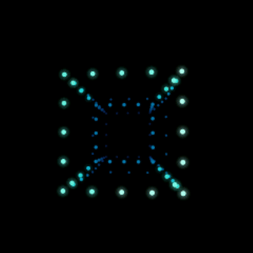
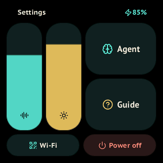

# Kubik

**Give your AI agent a place on your desk.**

Kubik is a small Wi-Fi voice companion built on the Waveshare ESP32-C6-Touch-AMOLED-2.16. Tess, an animated tesseract, listens, reacts and brings your agent’s replies to life. Your agent keeps its context and tools; Kubik provides the screen, microphone, speaker and physical controls.



*Current firmware renderer, with a simulated playback level. This is a UI demonstration, not a recording of response latency.*

Connect **OpenClaw** with the Kubik channel plugin; connect **Hermes** with its [native gateway platform](docs/hermes.md). Custom agents can use the [adapter SDK](docs/agent-sdk.md). Provider credentials stay on the agent host.

## Get connected

You need a flashed Kubik, a phone and a 2.4 GHz Wi-Fi network. For **Muse**, follow the [phone-only setup](#muse-without-a-host). For **OpenClaw or Hermes**, keep your agent running on a reachable computer or server and configure its speech providers, then follow these steps:

1. **Prepare your agent.** Follow the [setup page](docs/buyer/START.html) for OpenClaw or Hermes: install the integration and configure speech. OpenClaw supports local discovery with Server address left blank; Hermes uses `kubik://<server-address>:18793`. The guide explains remote addresses; a domain is optional.
2. **Connect Wi-Fi.** Scan the first QR to join Kubik’s setup Wi-Fi, then the second to open its setup page. Choose your home network, enter its password, select the agent and enter a server address if needed. Tap **Connect Kubik**; the device shows a pairing code when it reaches the host.
3. **Approve and talk.** Match the pairing code on the device and host, approve the request, and follow the on-device guide. Press **KEY** to start talking.

This repository is a **pre-publication source preview**. The setup page’s GitHub download addresses are marked placeholders; public downloads are not available yet. For source builds and local installation, use the [installation guide](docs/KIT.ru.md).

## Muse without a host

Experimental native Muse support uses **only your phone and Kubik**. Choose **Muse** in the Wi-Fi setup wizard, enter a personal [Muse SDK key](https://gadgets.muse.ai/settings/sdk-tokens), then pair in the Muse app under **Settings → Devices → Developer mode → Add device** and confirm with **KEY**. Bluetooth is used for pairing only; afterward Kubik connects directly over Wi-Fi. No computer, server address or Kubik host is needed.

On this C6 board, the current Muse SDK path accepts a voice note and returns **text**; TTS, Realtime, GPT Live and model selection are unavailable. Native cloud/device pairing is not yet verified. Personal tokens are not included in builds; SDK-token terms do not authorize embedding one in a retail firmware. See [Muse setup and limits](docs/muse.md).

## Everyday use

Buttons run left to right when looking at the screen: **BOOT · PWR · KEY**.

| Control | Action |
| --- | --- |
| BOOT, short press | Return to the previous screen |
| BOOT, hold | Open or close Settings |
| KEY | Start or finish voice input; end a Live conversation |
| PWR | Press to turn the screen off/on; hold about two seconds for power off/on |

Swipe Tess horizontally, vertically or diagonally to turn it in 3D and 4D; release to let its momentum fade.

When the screen is fully off, press **PWR** to wake it. Touch, BOOT and KEY are ignored until then; an incoming agent reply can wake it automatically. Background activity and reconnections keep the screen off. Touch restores a dimmed screen to full brightness; holding or dragging keeps it active.

Settings provides speech volume, brightness, **Agent**, **Guide** and **Status**. Status shows the current Wi-Fi address, gateway, DNS, MAC, DHCP name and agent endpoint on three swipeable pages. Hold the volume slider for 0.8 seconds to open **Sound**, with separate **Speech** and **Interface** sliders. Press BOOT to return. Both levels are saved independently. Tess synthesizes its short, syllabic reactions locally, with recognizable motifs, expressive endings and prime-length variation cycles. Emotions have distinct arrangements: warm overlapping pads, airy echoes or crossing voices. Menus, sliders, buttons and touch reactions share the same syllabic voice; simple actions stay brief. Replay the guide any time without resetting your connections. The hidden **Events** journal (five taps on the battery indicator in Settings) shows recent agent events: swipe to browse, tap for details, or enable a translucent overlay to follow events while Tess reacts. [Screen Lab](docs/screen-lab.md) previews situations without calling an agent.



*Current screen examples; transitions are a slideshow.*

Choose a voice mode in **Settings → Agent → Voice**:

| Mode | Conversation |
| --- | --- |
| STT | Record a message, then receive a spoken or text reply. Recognition and speech models are selected separately. |
| Realtime | Speak a turn; a pause completes your input. One voice model handles input and output. |
| GPT Live | A continuous conversation until you stop it. The microphone remains active through replies; host-side echo cancellation uses the speaker signal. |

Hermes currently supports STT (Classic); Realtime and GPT Live are available through OpenClaw. Availability depends on your host’s providers. Voice settings and the agent’s model are independent. Replies use speech when TTS is available and volume is at least 20; otherwise they appear as text. See [models and voice settings](docs/agent-controls.md) and [Realtime / Live setup](docs/native-voice.md).

On the awake home screen, Tess can also start voice input with **“Hi Tessa”**. The local detector recognizes *Tessa* and may activate without *Hi*. It is disabled in sleep, menus and other unavailable states. Audio before activation is not sent to the agent.

Kubik remembers up to eight Wi-Fi networks. Automatic sleep is silent. While sleeping on battery, it reconnects periodically to receive queued notifications; an unavailable network prevents delivery.

## Make it your own

Tess is the default character. Plush is a separate firmware build, selected before flashing; there is no character switch on the device.

To support another agent, implement an adapter against the [Agent SDK](docs/agent-sdk.md). The host handles pairing, device connections and the setup wizard; your adapter supplies the agent capabilities and interaction. Start with the documented examples and [wire protocol](docs/protocol.md).

## Build and contribute

The repository includes `firmware/assets/wake/tessa.tflite` for reproducible Tess builds. Its upstream license is unspecified; it is excluded from Kubik’s Apache 2.0 license. See the [model notice](licenses/Tessa-model-notice.txt).

Use ESP-IDF 5.5.1 for firmware. Node.js, uv and Chrome are also required for the complete acceptance suite; versions and prerequisites are in [acceptance](docs/acceptance.md).

```sh
idf.py -C firmware -B "$PWD/firmware/build" -DKUBIK_CHARACTER=TESS build
python3 tools/accept.py
```

Acceptance builds both characters and checks the renderer, protocol, setup pages and clean host installation. It does not publish or flash your device. Build outputs and local credentials are excluded from Git.

To reproduce the UI demonstration:

```sh
python3 tools/preview-dialogue.py --out /tmp/kubik-conversation-preview
```

Read [AGENTS.md](AGENTS.md) before changing behavior. [User scenarios](docs/scenarios/README.md) define the observable contract; update them alongside code, tests and instructions.

### Preview the UI without a device

Run `python3 tools/emulator.py` and open the printed local URL. The browser runs
real native firmware screens with touch, BOOT/PWR/KEY, tilt, Tess and Plush.
[Screen Lab](docs/screen-lab.md) also describes the hidden device menu and its
interactive preview controls. Full software acceptance requires no connected device.

To hear the offline particle contacts driven by the real rolling physics, run
`python3 tools/render-particles.py /tmp/kubik-particles.wav`. This renders a quiet
16-second sample at full Interface volume, including settling and silence.

## Documentation

- [Setup page](docs/buyer/START.html) and [printable A6 guide](docs/buyer/README.md)
- [Installation and maintenance](docs/KIT.ru.md)
- [Agent models and voice](docs/agent-controls.md)
- [Adapter SDK](docs/agent-sdk.md) and [protocol](docs/protocol.md)
- [Architecture](docs/architecture/README.md) and [acceptance](docs/acceptance.md)
- [Changelog](CHANGELOG.md)

The device UI and setup pages are in English. Maintenance documentation and behavior scenarios are currently in Russian.

## License and publication status

Project code, artwork, sounds and documentation are licensed under [Apache 2.0](LICENSE). See [NOTICE](NOTICE) and [third-party notices](licenses/README.txt) for component-specific terms.

**Exception: the included Tessa wake-word model has an unspecified upstream license.** Its inclusion does not establish permission for use or redistribution, including commercial distribution. It is not licensed under Apache 2.0; see the [model notice](licenses/Tessa-model-notice.txt).
