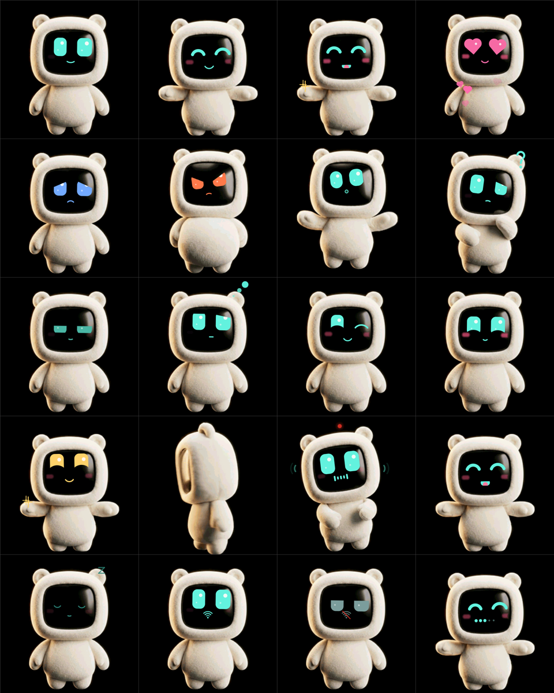

# История сценариев и проверок до рефакторинга

Это архив прежнего смешанного документа, а не текущие требования.
Актуальный контракт: [пользовательские сценарии](../scenarios/README.md).
Старые решения и числа ниже отражают указанные даты.

# Кубик: сценарии и поведение

Кубик — настольный голосовой помощник с персонажами Plush и Tess. Он отвечает
голосом, показывает настройку, состояние подключения и короткие подписи.
Ниже описаны общие действия и особенности каждого персонажа. Датированные
замеры сохраняют условия своих проверок; текущие изменения приведены первыми.

## Актуальные изменения и проверки — 01.10.2026

Требования из двух чатов Claude Code: [аудит](2026-10-01-claude-audit.md), [требования](../requirements.ru.md). Plush закончен по прежнему решению пользователя; его поведение не изменялось.

| Действие | Результат и проверка |
|---|---|
| Покой или фоновый шум | Микрофонный тракт закрыт, Tess не меняет взгляд и настроение из-за звуков комнаты; открытие передачи проверяется только через PTT |
| Несколько событий за один кадр, например тап и лёгкий толчок | Настроение и его звуковой отклик используют силу именно выбранной причины; порядок событий не меняет результат. `test-state.py` и `test-render.py` проверяют приоритет и возврат к покою |
| Открыть меню, настройку или статус | Иконки Lucide из закреплённого источника выводятся со сглаживанием в полном разрешении. Проверены изображения и renderer с ASan/UBSan. Обновлены только хеши кадров интерфейса; все потоки поведения и анимаций сохранились. Генератор: `tools/icons/build.py --check` |
| Ввести пароль Wi-Fi с открытой экранной клавиатурой | Кнопка подключения остаётся над клавиатурой, поле прокручивается в видимую часть. Playwright/Chrome: 390×844, 320×568 и 1024×768, уменьшение видимой области до 360 px, выбор Hermes и отправка формы. Это проверка геометрии, не физической клавиатуры Safari |
| Сохранить новую сеть или повторить её SSID | До восьми профилей; одинаковый SSID обновляет профиль, пустой пароль сохраняет известный пароль. Пробуются все известные сети, включая скрытые. `test-settings.py`, `test-wifi.py`, `test-setup.py`: миграция, предел, ошибки записи/commit, перебор сетей; страница получает только названия |
| Подключить Hermes или свой ESM адаптер | Мастер собирает поля адаптера и проверяет соединение; отдельный host использует общий протокол и явное pairing. SDK публикует activity, cron и notify. 166 тестов пакета; чистая установка архива без OpenClaw, импорт SDK, команда, мастер и подтверждение кода прошли. Установленный Hermes здесь не запускался; API проверен моками по официальному контракту |
| Отключить питание и погасить экран в покое | Wi-Fi радио останавливается. Проверка начинается через 60 с и далее каждую минуту, длится до 20 с. Пользователь, зарядка, настройка и работа прерывают сон. `test-power-network.py` и `test-wifi.py`: точные границы, защитные условия, остановка и возобновление. Физический ток и разряд не измерялись |
| Отправить событие спящему устройству | Сервер хранит уведомления на диске до повторной авторизации: 8 на устройство, 128 всего, срок 24 ч. Отзыв ключа удаляет его очередь; после начала вывода повтор не выполняется. Проверены перезапуск, FIFO, PTT, обрыв, отзыв и `played` ACK. `test-device-notify.mjs`: настоящее устройство с локальным сервером, очередь → пробуждение экрана, голос → фактический ACK. Минутный режим без USB физически пока не проверен |
| Началась активность или cron-задача | Новый активный снимок либо увеличение числа запущенных cron будит экран. Пустой/повторный снимок не будит без нового события; при выключенном радио событие можно получить в ближайшее окно связи |
| Нужен полный сброс | BOOT → пять тапов по проценту батареи за 4 с → Reset дважды за 3 с. Стирается весь namespace настроек, включая сети, сервер, доверие и ключ; перезагрузка требует нового pairing. Проверены скрытие/жест/первое подтверждение, erase и commit failures. Само подключённое устройство полностью не стирали, сохранив его действующее сопряжение |

Подключённый Кубик: приложение прошито по USB с сохранением NVS, Tess; полный прогон экранов/реакций/настроений прошёл за 145 с: 30 fps и 0 поздних кадров, худший кадр 32,4 мс в «испуг + всплеск». Голосовой прогон на локальном mock: 5,36 с воспроизведения, 0 разрывов, худший кадр 33,2 мс. Это не доказывает отсутствие tearing глазами. Панель осталась на 40 МГц. Сборка ESP-IDF успешна, в разделе приложения осталось около 61 КБ (4 %).

Комплект собран локально. По отдельному указанию пользователя пакет установлен в хостовый OpenClaw на `root@<agent-server-ip>` (systemd user service, без Docker). OpenClaw 2026.9.7 и Node 24.16.0 сохранены; конфигурация каналов, модели, включённые плагины и pairing не менялись. Пакет проверен на установленном SDK до переключения; безопасный перезапуск выполнен при нулевой активной работе. Health и probes Кубика/Telegram/VK проходят, все 10 cron-задач сохранились. Кубик подключился по прежнему WSS-адресу без нового одобрения.

| Действие на рабочем сервере | Проверенный результат |
|---|---|
| Погасить экран Кубика, временно отключить его Wi-Fi-маршрут и отправить `[[show]]…[[/show]]` через `openclaw message send` | Уведомление сохранилось в `/root/.openclaw/kubik/notifications.json` с правами `0600`; экран оставался погашенным. После восстановления маршрута устройство авторизовалось по прежнему ключу, очередь очистилась и экран проснулся. STT/LLM/TTS не вызывались; проверялась карточка уведомления. Выполняется `node tools/test-deployed-queue.mjs --host root@<agent-server-ip>`; маршруты, экран и настройки возвращаются |
| Сохранить состояние перед установкой | Архив плагина/настроек и согласованный online-backup SQLite проверены в `/root/openclaw-backups/kubik-pre-update-20261001T141649Z`; файл состояния прошёл `quick_check` |

Платные API, физический минутный режим без USB, реальные Windows/Docker и установленный Hermes не проверялись.

## Управление

| Действие | Что происходит |
|---|---|
| **Нажать KEY (IO10) коротко** | запись начинается и продолжается без удержания кнопки: над головой красная точка REC, по бокам «уши»-волны, вместо рта живой индикатор громкости. Кубик наклоняется и слушает |
| **Нажать KEY ещё раз** (или тапнуть по экрану) | фраза уходит на сервер, Кубик задумывается: пузырьки мыслей, лапка у подбородка |
| **Зажать KEY и держать** | классический push-to-talk: запись идёт, пока кнопка зажата, и отправляется, когда её отпускают |
| Зафиксированная запись дольше 60 с | отправляется сама |
| **KEY во время ответа** | ответ обрывается, сразу начинается новая запись (перебивание) |
| **Тап по экрану во время ответа** | остановить ответ |
| Тап по глазу | глаз зажмуривается |
| Тап по мордочке | радость и подпрыгивание |
| Тап по плюшу | подпрыгивание, иногда смущение или помахивание лапкой, иногда хихиканье |
| **Погладить** (долгое касание или проведение пальцем) | обнимашки: лапки к груди, глаза-сердечки, летящие сердечки |
| **Встряхнуть** | Кубик кружится, глаза-спирали |
| Взять в руки или толкнуть стол | удивление, просыпается |
| Наклонить | Кубик смотрит в сторону наклона |
| **BOOT коротко** | громкость по кругу 20→40→60→80→100 %: точки громкости на экране-мордочке и звук, который становится выше с каждым шагом; в открытом меню — закрыть меню |
| **BOOT долго** (0,8 с) | открыть или закрыть меню настроек |
| **PWR коротко** | выключить или включить экран; микрофон и кнопка продолжают работать |
| **PWR 2 с** | выключить: Кубик засыпает с пузырём «Turning off», экран гаснет, питание отключается. Включить — коротко нажать PWR |
| Меню настроек | плитки на весь экран: два высоких ползунка, громкость и яркость (тянуть пальцем или тапнуть по нужной высоте; цифра видна, пока палец на ползунке); переключатель **Plush / Tess**; внизу **Wi-Fi** (значок QR) — временная сеть Кубика и страница настройки, **Power off** — повторный тап за 3 с выключает устройство. **Reset** появляется только после пяти тапов по проценту заряда за 4 с и тоже требует повторного тапа за 3 с. Выбора голоса и режима ответа в меню нет: каждая реплика идёт по цепочке STT → агент → TTS, голос задаётся в настройках `tts` OpenClaw. Закрыть — BOOT коротко или долго, свайп вверх, KEY или 30 с без касаний. |
| PWR 4 с | аппаратное выключение (AXP2101), если прошивка зависла |

## Тело и лицо

Тело — 13 анимаций (кадры из видео, см. актуальные сценарии ниже). Лицо рисуется
поверх экрана-мордочки в каждом кадре: следит за его положением, наклоном и
видимостью. Если Кубик отворачивается или закрывает мордочку лапками, лицо
пропадает вместе с экраном.

| Состояние | Тело | Лицо | Откуда берётся |
|---|---|---|---|
| Загрузка / приветствие | машет лапкой | глаза открываются | старт, пробуждение, уведомление |
| Ожидание | стоит и дышит, каждые 3–9 с мелкие движения: переминается, наклоняет голову, иногда машет | моргание, блуждающий взгляд | локально |
| Слушаю | наклоняется вперёд, «прислушивается» | большие внимательные глаза, индикатор громкости, REC, уши-волны | **только** открытый шлюз захвата микрофона |
| Думаю | лапка у подбородка, покачивается | взгляд вверх, пузырьки | сервер: `transcribing`/`thinking` |
| Говорю | жестикулирует лапками | рот по реальной громкости звука из динамика | фактическое воспроизведение |
| Эмоции | joy — прыжок с поднятыми лапками; love — обнимает себя; sad — поникает головой и плечами; surprised — отпрянул; angry — топает, руки в боки; shy — прикрывает мордочку; dizzy — кружится | глаза и рот по эмоции | тег `[[emotion]]` в ответе агента |
| Сон | через 3 мин без дела засыпает, клюёт носом | закрытые глаза, «Z»; затем яркость плавно снижается и через 15 с экран гаснет | локально |
| Нет связи с сервером | ожидание | серые глаза, разорванное соединение устройства с сервером | нет `welcome` от сервера; Wi-Fi при этом может работать |
| Настройка | анимация приостановлена | QR-код с подтверждением и статус подключения | сеть не настроена, Wi-Fi недоступен 60 с при включённом экране или Wi-Fi в меню настроек |
| Cron | — | часики в правом верхнем углу: золотые и крутятся, пока в OpenClaw выполняется cron-задача; голубые с обратным отсчётом (`45s`, `12m`, `3h`), если запланировано разовое напоминание | сервер: `cron` |
| Батарея | — | постоянный процент заряда при ≤15 % у обоих персонажей, включая сон; при зарядке меняется статус | AXP2101 |

Смена анимаций использует граф соседних поз текущего пакета.
Незавершённое движение доходит до связанного перехода через промежуточные клипы.
Когда нужно слушать, переход ускоряется.

## Звуки

82 коротких звука в одной тональности: до-мажорная пентатоника, калимба,
мягкие колокольчики, «бульки». Все сведены к −20 LUFS, так что ни один не
режет ухо. У частых событий несколько вариантов, выбор случайный и без повтора
подряд:

- 6 тапов, 3 хихиканья;
- 3 начала и 3 конца записи;
- 3 «думаю»;
- 2 «не расслышал»;
- 2 ошибки;
- 5 ступеней громкости.

Пока звучат собственные звуки Кубика, микрофон передаёт тишину, чтобы они не
попали в запись.

| Событие | Звук |
|---|---|
| Старт | восходящее арпеджио калимбы и колокольчик |
| Начало записи / фиксация записи | два восходящих «булька» / двойной «тик» |
| Отправка | нисходящие «бульки» и мягкий «вжух» |
| Думаю (через 2,5 / 6,5 / 10,5 с ожидания) | тихие капли-колокольчики |
| Уведомление | «дин-дон» |
| Радость, любовь, грусть, удивление, головокружение | свои короткие мотивы |
| Не расслышал | вопросительная интонация (голосом, если это первый раз за 10 минут) |
| Ошибка, нет связи | мягкий нисходящий мотив, без «жужжания» |
| Сон / пробуждение, экран вкл/выкл, подключение | тихие переходы |
| Меню настроек: открыть / закрыть | мягкий «вжух» вверх с двумя нотами маримбы / он же вниз |
| Голос: следующий / предыдущий | деревянный щелчок колёсика вверх / вниз (плагин больше не предлагает список голосов, тап даёт «не-а») |
| Переключатель режима | щелчок переключателя с защёлкой (плагин больше не предлагает режимы, тап даёт «не-а») |
| Ползунки громкости / яркости | «зубчик» на каждые 10 %, высота растёт по пентатонике: деревянный у громкости, стеклянный у яркости |
| Power off: первый тап / отмена / выключение | два осторожных низких стука / мягкий спад / «спокойной ночи» — нисходящая калимба |
| Недоступно (нет связи, сервер не подтвердил выбор) | приглушённое «не-а» |
| Карточка текста: следующая страница / закрыть; тап, обрывающий ответ | шелест страницы / «вжух» вниз |

Звуки генерирует `tools/sfx/generate.mjs`, а проверяет громкость и пики `tools/sfx/verify.mjs`.

## Голосовые сценарии (через OpenClaw)

Агент OpenClaw видит Кубика как канал: каждая фраза — входящее сообщение, а
ответ агента озвучивается. Поэтому доступно всё, что умеет агент:

* **Вопросы и справки** — «Сколько будет 17 процентов от 2400?», «Что такое
  квазар?». Агент отвечает коротко, разговорно, без markdown.
* **Напоминания и таймеры** — «Напомни через 20 минут снять чайник». Когда
  агент срабатывает сам (cron, напоминание), приходит `speak kind=notify`:
  Кубик просыпается, звучит «дин-дон», по мордочке расходится кольцо, Кубик
  машет лапкой и говорит.
* **Заметки и задачи** — «Запиши идею: …», «Что у меня на сегодня?» (если у
  агента есть соответствующие инструменты).
* **Сообщения** — агент может по голосовой команде отправить что-то в другие
  каналы OpenClaw (Telegram, VK) и, наоборот, прислать уведомление на Кубика.
* **Эмоциональный отклик** — агент ставит `[[joy]]`, `[[sad]]` и т. п. в
  начало ответа. Тег не произносится, а запускает анимацию тела и лица.

## Локальные голосовые подсказки (без сети)

Подсказки записаны голосом Milena (`tools/gen-prompts.sh`) и лежат в разделе
ассетов, поэтому работают и без сервера:

- «не расслышала»;
- «нет связи с сервером»;
- «режим настройки»;
- «что-то пошло не так»;
- «секундочку, я ещё думаю»;
- приветствие при первом подключении.

## Персонажи, камера и рендер — актуальные сценарии 28.09.2026

Автопроверки: `python3 tools/test-render.py`, `python3 tools/test-tess.py`,
`python3 tools/test-settings.py`. Визуальную оценку физического экрана они не заменяют.

| Действие | Результат |
|---|---|
| В меню выбрать Plush или Tess, закрыть меню и перезапустить | Выбранное имя и персонаж сохраняются; сеть для выбора не нужна |
| Выбрать Tess | Plush не обновляется, спрайты не отображаются через MMU; 112 точек вспыхивают искрой в центре и за ~1 с разворачиваются в тессеракт |
| Выбрать Plush | Состояние и синтезатор Tess освобождаются; его точки и эффекты не вычисляются |
| Открыть меню | Симуляция скрытого персонажа приостанавливается |
| Наклонить или повернуть кубик с Tess (в том числе вокруг оси экрана) | Tess поворачивается вокруг своего центра в ту же сторону, что и кубик, на 0,4 угла поворота (подобрано на устройстве); облако всегда в центре и на экране. Поза экстраполируется на 45 мс вперёд |
| Удержать наклон, затем вернуть | Пока кубик движется или покоится меньше 2,5 с, объект «висит в комнате»; дальше нейтраль мягко (≈4 с) подстраивается под новую позу. Проверить лёжа и стоя |
| Повернуть кубик в другую сторону | Открывается другая сторона объёма; знак и ощущение глубины проверить руками |
| Нажать на Tess | Мгновенно: взгляд и «нырок» тела, и от точки нажатия бежит волна по точкам (≈6,5 ед./с, через весь куб за ≈0,4 с): каждая точка сдвигается от пальца и чуть к зрителю, пружины дают лёгкий перелёт; до трёх волн одновременно; потом точки точно на местах |
| Коснуться, погладить, встряхнуть | Касание пускает по облаку светлую волну от пальца; поглаживание волной собирает бьющееся сердце; сильная встряска разносит точки и собирает обратно |
| Слегка толкнуть или потрясти кубик | Дрожат сами точки, каждая по-своему (случайные толчки пружинам); тело в целом не трясётся и не дёргается: только плавный взгляд на вас. При продолжительной тряске точки дрожат сильнее, облако светлеет и быстрее вращается |
| Оставить Tess в покое | Живой idle (`tess_mood.c`), а не вращение в одну сторону: цепочка «ходов» случайной длины (без периода): дрейф (скорость до ±0,4 рад/с, направление и ось наклона меняются), покой (почти замирает), любопытный взгляд в сторону (до ≈0,5 рад), лёгкое покачивание (крен ≈0,1–0,2 рад) и изредка (раз в 25–55 с) маленький 4D-поворот. Дышит и чуть приближается/отдаляется (±6 %, период ≈14 с). При встряске точки отстают и дрожат |
| Смотреть на 4D-поворот в покое | Только плоскость Y-W, до ≈0,5–0,7 рад, не быстрее ≈0,4 рад/с: медленно входит, держится пару секунд (вращение вокруг вертикали в это время почти замирает) и возвращается; внутренний куб «кивает» вверх/вниз. В разговоре X-W и Z-W: при ожидании 1,25 и 0,55 рад/с, при речи медленнее и по голосу; в покое 4D редкое, малое и в другой плоскости |
| Оставить Tess надолго без касаний и движения | Через ≈20 с без касаний и без движения IMU становится сонливее: скорость и размах ходов падают до ≈35 %, чаще покой, реже взгляды, покачивания и 4D; полностью к ≈120 с (тогда приложение включает и «сонное» лицо) |
| Низкий заряд (≤15 %, без зарядки) / зарядка | Низкий: вялый: скорость и размах вдвое меньше, чаще покой, без 4D-поворотов. Зарядка: довольный: чаще покачивается |
| Поднять кубик, тапнуть, уведомление | Подъём и пробуждение: взгляд в сторону, бодрее на ≈5 с; тап: ближняя сторона поворачивается к пальцу; уведомление: короткое «тревожное» покачивание |
| Встряхнуть, затем оставить | Голова кружится ≈2,5 с (наклоны и крен вразнобой), потом длинный «вдох» покоя, без рывков |
| Слушать / говорить | Слушает: анфас, слегка наклоняется вперёд к голосу, вращение медленное; говорит: наклоны и крен пульсируют вместе с голосом, вращение живее |
| Нет связи | Точки лежат кучкой; каждые 4–9 с то вздохнут, то расшевелят её (беспокойство) |
| Начать запись и говорить с разной громкостью | Облако перетекает в ровную вращающуюся сферу, по её поверхности бегут волны от голоса; вокруг неподвижное кольцо из 18 красных светящихся точек (радиус 150), голос по очереди раздувает их; отдельной красной точки сверху нет |
| Отправить фразу (ожидание ответа) | Сфера возвращается в тессеракт; он плавно приближается (множитель формы 1,34) и непрерывно вращается в 4D (плоскости XW и ZW), поэтому в 3D выворачивается наизнанку: внутренний куб выходит наружу; по рёбрам бегут огоньки |
| Дождаться голосового ответа | Tess остаётся ближе (множитель формы 1,40), мягко кивает вместо прыжка. По огибающей фактически воспроизводимого PCM равномерно пульсирует, чуть теплеет и ускоряет 4D-поворот; случайной тряски точек от речи нет. Перспектива меняет видимый размер; облако с ореолами целиком подгоняется в границы экрана |
| Пауза в речи, краткое ожидание следующего фрагмента, конец ответа | Огибающая затухает; в тишине вращение медленнее. Новое ожидание продолжает текущую позу. После ответа размер и оттенок плавно возвращаются к обычным; 4D-поворот доворачивается до ближайшей четверти, без зависания под промежуточным углом |
| Смена формы (тессеракт, сфера записи, сердце, разлёт, сон) | Точки взаимозаменяемы: при смене формы каждая точка занимает ближайшее свободное место новой формы, а не своё закреплённое, поэтому переход короткий и без «перетасовки» через всю фигуру |
| Воспроизвести аудиопоток | От центра расходятся кольца набухания по фактическому уровню проигрываемого звука |
| Смотреть на цвет точек | Чисто белого нет. Цвет и свечение показывают глубину: градиент от дальних к ближним: #14051D 0% → #102052 20% → #095A96 42% → #08A6CE 62% → #2BE2D2 80% → #7AF4DF 92% → #D5FFF4 100%; яркость растёт равномерно с близостью, ближние крупнее и с ореолом. Глубина учитывает и 4-ю ось: внутренний (дальний в 4D) куб тёмный и мелкий. Эмоции меняют палитру (золото, коралл, розовый, синий, серый); речь добавляет слабый тёплый оттенок по уровню PCM, сохраняя шкалу глубины |
| Характер Tess | Глаз и лица нет: милота только в поведении точек. Облако «смотрит» — наклоняется в сторону внимания (в покое оглядывается, при мышлении вверх-вбок, при записи и речи на собеседника, без связи вниз) |
| Тапнуть в центр Tess несколько раз с паузами | Каждый раз разная реакция, подряд не повторяется: прыжок-«боинг», волна-покачивание, кружение, поклон со смущением (розовый); растяжений и сплющиваний формы нет; сила случайная |
| Тапнуть по краю облака | Либо вздрагивает и отшатывается от пальца, а через ~1 с тянется обратно, либо прижимается к пальцу |
| Быстрая серия тапов | 3-й — хихиканье (золото, подпрыгивания), 4–5-й — кружение, 6-й — точки разлетаются, «голова кружится» |
| Погладить | Облако ластится к пальцу и собирается в бьющееся сердце |
| Поднять кубик / уведомление / ошибка | Подъём — подскакивает и оглядывается; уведомление — подскок; ошибка — поникает и через полсекунды вздрагивает |
| Оставить Tess в покое | Раз в 5–11 с мелкая «возня»: подскок, покачивание, поворот, поклон или дрожь (не повторяется подряд) |
| Коснуться Tess пальцем | В том же кадре: тихий тик и лёгкое «продавливание» облака от точки касания (≈9 px, жёстко, без сжатия), Tess поворачивается к пальцу и смотрит на него ещё ≈0,8 с после отрыва |
| Провести пальцем по Tess | Облако цепляется за палец и катится за ним, быстрый бросок раскручивает его, через ≈1,1 с оно качается обратно; три броска подряд — бочка и радость |
| Часто тапать | Каждый тап — свой отклик с нарастанием (3-й — радость и подскок, 4–5-й — кружение, 6-й — испуг и разлёт) |
| Долго держать или гладить | Довольное медленное покачивание ≈5 с и тихое мурчание-дрожь; палец останавливает кружение |
| Не трогать 25–40 с | Зовёт: вилять и подпрыгнуть, отвернуться и выглянуть или поклониться и закружиться; ждёт 5,5 с и зовёт ещё раз; палец в ответ — радость. После двух безответных зовов — шалость: отвернуться и неожиданно повернуться, бочка или «спрятать ячейку» (четверть 4D-поворота) и вернуться |
| Коснуться Tess, которую давно не трогали (>12 с) | Иногда (1 из 5, не чаще раза в 25 с) отпрыгивает в сторону, выглядывает; если поймать пальцем — радость |
| Резко встряхнуть Tess | Испуг: подскок и дрожь с отставанием; звук в тот же кадр. Сильная встряска дальше разлетается на ≈2,5 с: точки швыряет по всему экрану до краёв и углов (у каждой своё направление и расстояние; сила тяжести по датчику слегка сгибает полёт), торможение с плавной остановкой; ≈0,6 с напряжения: точки держатся вдали, дрожат всё сильнее и трижды тянутся к дому, каждый раз отдёргиваясь, как натянутая пружина; затем магнитное возвращение с нарастающим ускорением (каждая точка со своей задержкой), щелчок, затухающие покачивания и точная форма тессеракта. Слабая тряска только трясёт точки поодиночке |
| Вернуться к покою после 4D-поворота | Углы 4D доворачиваются до четверти оборота: внутренний куб точно в центре внешнего (раньше постоянные 0,35 рад давали смещение до 37 px); асимметричные положения только в движении |
| Офлайн-кучка точек | Изредка 1–3 точки вспыхивают быстрее и гаснут за 0,15–0,4 с (сид лица, без периода); перерисовываются только их полосы |
| Начать слушать / получить ответ | Кивок «да?» при начале записи; подскок, когда мышление сменяется речью |
| Уснуть (3 мин без дела) | Точки плавно (≈6 с, каждая со своей задержкой) разлетаются в разные стороны на разное расстояние, становятся мельче и медленно плавают, как пыль; вращение почти замирает |
| Разбудить | Точки за ≈1,5 с собираются обратно в тессеракт, затем маленький подскок |
| Сон, «сонный» | Сон: облако разлетевшейся пыли; «сонный» (в покое) — форма чуть меньше, темнее и медленнее |
| Нет подключения (Wi-Fi или OpenClaw) дольше порога | Все точки падают по реальной гравитации (акселерометр) внутрь круглого стекла экрана и лежат кучкой; при наклоне и повороте кубика катятся и пересыпаются, как шарики (столкновения точка–точка и со стеклом, трение, в покое не дрожат). После восстановления связи собираются обратно в тессеракт. Tess чёрно-белый (поверх любых эмоций); значок «нет Wi-Fi» или «нет сервера» стоит справа сверху на месте часов cron, без пузыря. Отказ и отсутствие плагина по-прежнему показываются пузырём с текстом |
| Прислать эмоцию с сервера (`[[joy]]`, `[[sad]]`…) | Tess тоже реагирует: радость — подпрыгивания и золото, любовь — сердце, грусть — поникший синий, злость — дрожь и коралл, смущение — сжатие и розовый, удивление — всплеск, непонимание — наклон набок, головокружение — разлёт |
| Вызвать звуки Tess | Одно семейство в ре-мажорной пентатонике (не выше B5, ≈1 кГц): размеренные пэды из чистых синусов и FM с малым индексом, расстроенный хор, субоктава или квинта, медленные глиссандо, тёмный ревёрб. Шума, вибрато и дрожания нет, звона в верхах нет. Быстрые реакции (касание, хлопок, бросок) — мягкие всплески-набухания с началом за 10–50 мс. Звуки синтезируются в прошивке на лету, записей нет. Касание — нота по высоте стороны касания (2–3 варианта, случайный шаг по гамме); чаще всего звучащие (касание, растирание, взгляд) тише всех; тревоги (уведомление, ошибка, включение) — на уровне Plush |
| Двигать или наклонять кубик с Tess | Тишина: у поворота и наклона звука нет |
| Начать запись или речь во время реверба | Хвост сбрасывается; он не продолжает заглушать микрофон |
| Перевести Plush между режимами | Маршрут идёт по связям поз; все 52 проверяемых перехода достигают цели |
| Дать Plush уснуть | Доходит до спящей позы и дышит; нет петли обратного засыпания и двойного силуэта |
| Отрисовать 630 исходных поз в двух временных состояниях | Полный RGB565 совпадает с результатом изменившихся окон; арена не переполняется |
| Воспроизвести движение с переменным шагом 20–100 мс | Физика остаётся ограниченной, память проверяется ASan/UBSan |
| Смотреть быстрые движения на панели | Проверить рывки и шов глазами: 30 fps в журнале не доказывают отсутствия разрывов |
| Выбрать Plush после Tess при QSPI 40 МГц | Мех сохраняет светлый цвет, нет бирюзовых полос или следов точек; проверить физический экран, программная модель не проверяет передачу QSPI |

28.09.2026 пользователь подтвердил нормальные цвета и исчезновение полос после
возврата QSPI с 80 на 40 МГц. Повышенную частоту не считать проверенным режимом.

Кадр 240×240 полностью составляется перед передачей, затем увеличивается до
480×480. Арена RLE — 48 КиБ, измеренный максимум — 40 587 байт. Исходные
спрайты имеют 10/15 кадров/с, рендер — 30; временного смешивания двух поз нет.
TE не подключён к GPIO. Проверка чтения строки панели не сработала;
аппаратная синхронизация с развёрткой не реализована.

## Экономия ресурсов без изменения качества

| Действие | Ожидаемый результат |
| --- | --- |
| Запустить `python3 tools/test-render.py` | Все 630 исходных кадров, 1 260 состояний анимации и 3 248 сочетаний режима/эмоции/звука/наклона/частиц проходят без потери RGB565-пикселей |
| Запустить `python3 tools/test-link.py` | Максимальные пакеты речи (4 800 байт PCM), микрофона (1 920 байт PCM) и JSON (4 096 байт) проходят; превышение лимита отклоняется на USB и Wi-Fi. USB challenge при статусе `probing` подписывается только для текущей эпохи, маршрут не открывается до `welcome`; `F_CONFIG` получает ответ ещё до heartbeat и выбора маршрута, пакет с неверным CRC отбрасывается |
| Выключить экран кнопкой и включить снова | Пока экран выключен, сцена не строится и не рисуется; состояние персонажа обновляется 10 раз в секунду, включение возвращает актуальную анимацию |
| Экран погас (кнопкой или после сна), разговора нет | «Дрёма»: как только доиграл последний звук, оба аудиокодека (ЦАП ES8311 и АЦП ES7210) выключаются, каналы I2S останавливаются (буферы DMA сохраняются — без повторного выделения памяти), Wi-Fi переходит в `WIFI_PS_MAX_MODEM` с пропуском двух маяков из трёх. В логе `codecs dozing` / `codecs awake`. Любой звук, речь, запись или включение экрана будит кодеки за ~40 мс |
| Оставить кубик подключённым по USB, затем отключить маршрут моста | Освобождённая память доступна приложению; кубик подключается напрямую по защищённому Wi-Fi и воспроизводит речь целиком |
| Вернуть USB-маршрут после Wi-Fi | Wi-Fi остаётся основным: USB запрашивается (hello) только пока сессии Wi-Fi нет, и берёт маршрут только после авторизованного `welcome`; память закрытого WebSocket освобождается |

Буфер очистки экрана существует только при запуске и освобождается после окончания DMA.
Микрофон и динамик повторно используют собственные рабочие буферы вместо копий.
Кольцо речи, очереди USB, качество изображения, формат аудио сохранены; рендер работает на 30 Гц.

## Настройки и батарея (28.09.2026)

| Действие | Результат |
|---|---|
| Открыть настройки | Одна сетка с отступом 20 px от края и 12 px между плитками: два высоких ползунка на всю ширину (громкость слева, яркость справа, по 214 px, y 56–308), ниже переключатель Plush/Tess (y 320–384), внизу Wi-Fi, Reset и Power off (y 396–460); компактный процент заряда в правом верхнем углу. Плиток голоса и режима ответа нет (30.09.2026: удалены вместе с запросом `prefs`); плитки появляются по очереди: ползунки, переключатель, три кнопки |
| Выбрать персонажа | Светлая подсветка переезжает к выбранному персонажу; плитка коротко вспыхивает под пальцем |
| Нажать компактные Wi-Fi / Выключить внизу | QR-иконка и значок питания видны рядом с текстом; прежнее действие и подтверждение выключения сохранены, заряд не нажимается |
| Получить показание 16% | Уведомления поверх персонажа нет |
| Получить 15% или 0% | Небольшой коралловый процент сверху справа без плашки, одинаковый у Plush и Tess, в том числе во сне |
| Подключить зарядку при ≤15% | Процент остаётся и становится мятным, перед ним значок-молния; выше 15% исчезает (в настройках процент с молнией виден всегда) |
| Получить ошибку датчика, значение вне 0–100 или отсутствие батареи | Нет ложного предупреждения о разряде; в настройках «—» |

Заряд обновляется существующим опросом PMIC раз в 5 секунд. Автопроверка:
`python3 tools/test-render.py` — порог, зарядка, ошибочные показания, оба персонажа,
сон и новые области касаний. Разряд физической батареи до 15% не проводился;
низкий заряд проверен управляемыми состояниями симулятора.

Реакции Tess проверяются на непрерывность старта и возврата, постоянные 112 точек,
завершённый кадр и границы памяти. Камера проверяется на отклик за один отсчёт,
выдержку перед адаптацией и плавное выравнивание после поворота на 90°.
Поднятие приподнимает слои точек, уведомление пускает объёмную волну,
ошибка сжимает и опускает форму, непонятая фраза смещает противоположные слои.
Физическое ощущение камеры и художественная оценка форм требуют проверки на кубике.

| Действие | Результат |
|---|---|
| Прервать сердце встряской или сменой режима | Все 112 точек сохраняют координаты и скорости; меняется только цель пружины, нет старта из исходной формы |
| Подавать события с шагом 20–100 мс | Точное решение затухающей пружины остаётся ограниченным; положения и скорости конечны |
| Рассмотреть ближние и дальние точки | Передние доходят до белого и имеют мягкий ореол; дальние переходят через бирюзовый в тёмно-синий |
| Сравнить Tess и Plush при одной громкости | Усилен только синтез Tess на 12 дБ, общая регулировка сохранена; низкий тембр и реверб сохранены, пики мягко ограничены ниже 32000 PCM |

Экран: раз в 2 с прошивка между кадрами заново отправляет панели регистры настройки (без сброса питания, незаметно) — панель однажды перестала принимать кадры, и помогла только переинициализация. Команда USB `{"cmd":"lcd"}` полностью переинициализирует панель, `{"cmd":"set","brightness":N}` задаёт яркость 10–255.

28.09.2026, второй проход (4D-проекция, цвет глубины, неподвижный в комнате объект): покой 27,4 мс/кадр,
запись 32,0 (7 кадров из ~600 сверх 33,3 мс, средние 30 fps), мышление 27,1, речь 29,1.

28.09.2026, переработка Tess: на кубике (QSPI 40 МГц, по USB) все режимы 30 fps без кадров
сверх 33,3 мс — покой 26,5 мс/кадр, запись 31,4 мс (макс. 32,4), речь 29,1, мышление 29,4, сон 26,4.
Без FPU формы пересчитываются для половины точек за кадр, пружины — для всех.
Касание Tess: RMS первых 100 мс 3397 (у Plush ~3400), основной тон 80 Гц.

Автоматически проверены сохранение инерции при прерывании, переменный шаг,
порог слышимости и ограничение всех 41 звукового мотива. Измерение PCM после
изменения: первые 100 мс касания Tess RMS 2413, поглаживания 3525;
исходные звуки Plush имеют RMS около 3400 и 3260 соответственно.

На устройстве с QSPI 40 МГц после установки проверены прерывание поглаживания
встряхиванием и более двух минут рендера Tess: установившиеся 30 fps,
примерно 27–29 мс на кадр, без watchdog и переполнения кадра в этом прогоне.
Оценка воспринимаемой громкости ожидает обратной связи пользователя.

28.09.2026, характер Tess через поведение точек (глаза убраны): реакции — разовые импульсы скоростей,
пружины превращают их в отскок и желе, поэтому на кадр ничего не добавляется. На кубике: покой 27,2 мс/кадр,
запись 32,4 мс (7 кадров сверх 33,3 мс за 10 с), мышление 27,4, речь 29,3 — все 30 fps.

28.09.2026, градиент глубины и запись: цвет и размер точки считаются по 3D-глубине плюс 4D-глубине (пока это тессеракт).
Экран раз в 4 с полностью перерисовывается полосами по 2 строки (кроме тяжёлых кадров) — залипшие неверные пиксели
исчезают сами. На кубике: покой 27,9 мс/кадр, запись 32,2 (23 кадра сверх 33,3 мс за 10 с), мышление 27,9, речь 29,7 — 30 fps.

28.09.2026, звуки Tess переписаны на пэды: каждая нота — два слегка расстроенных генератора через мягкий двухполюсный
фильтр, который приоткрывается на нарастании; медленная атака, длинное затухание, новый звук не обрывает старый
(тот гаснет за 60 мс), аккорды sus2/maj9/минор на пентатонике ре мажор от D3, тёмный хвост ревербератора (кроме записи).
Регистр D3 и выше, срез баса ~120 Гц: динамик кубика не играет ниже ~200 Гц, такой бас только дребезжит.
Касание: RMS первых 100 мс ~3900 (Plush ~3400), основной тон 185–247 Гц в зависимости от места касания.
Пэды: по три голоса на ноту (центр ±4 цента), медленное «дыхание» фильтра, ревербератор — две гребёнки с демпфированием
и два диффузора (хвост ~1,3 с). Тихий поворот: ~-30 дБ от касания.

28.09.2026, звук включения и выключения Tess: четыре гармоничных колокола D4 A4 D5 A5 (поднимаются при включении, опускаются при выключении, шаг 170 мс), тихий чистый пэд и шиммер, без «ветра» — прежний резонансный ветер и биения расстроенных пэдов звучали как жужжание мух.

28.09.2026, падение точек без связи: столкновения в фиксированной точке (1/4096), без FPU float-версия давала 37,6 мс/кадр; теперь 24,7 мс/кадр, 30 fps. Покой 27,7 мс/кадр, мышление 30,8 (с 4D-вращением и увеличением) — 30 fps. Экран выключен: 3 мс/кадр при 10 кадрах/с вместо ~28 мс при 30.

28.09.2026, падение при пробуждении с записью: переполнение стека задачи display (перестановка точек держала на стеке ~4,7 КБ). Буферы перестановки ужаты до ~3,3 КБ (16-битные координаты), стек display 7 КБ; лог `present: … stack free N` показывает запас (после всех режимов, сна и выключения экрана — 2,3 КБ), минимум кучи 15 КБ.

29.09.2026, оптимизация кадра без FPU: при выключенном экране Tess не считается (персонаж замирает, идут только часы и таймеры), точки раскладываются по полосам экрана один раз за кадр и рисуются без делений на пиксель, проекция 112 точек и падение без связи — в целых числах, коэффициенты пружин — рекуррентно (2 `expf` и 4 `sinf/cosf` вместо 12 вызовов). На кубике (160 МГц, по USB), мс/кадр до → после, в скобках персонаж: покой 26,2 → 22,4 (6,5 → 4,2), запись 30,2 → 26,9 (7,5 → 6,1), мышление 29,1 → 25,9 (6,1 → 4,4), речь 28,1 → 24,2–24,7 (6,8 → 5,1), без связи 25–27,4 → 15,1 (10,7–11,1 → 4,7–4,8), касания 29,8 с 8 кадрами сверх 33,3 мс → 22,2 без них; всё 30 fps. Экран выключен: персонаж 8,1–8,4 мс → 0,03–0,13 мс при 10 кадрах/с.

30.09.2026, звуки Tess: одно семейство вместо десятка разных «функций». Каждый звук — короткая фраза из таблицы (`tess_sound_kit.c`): ноты только гаммы ре мажор (пентатоника), голоса — те же колокол, пэд, ветер, шиммер; движение, задержку и высоту считает один проигрыватель (`tess_sound_play.c`). Громкость по классам (самые громкие 100 мс, dBFS): касание и взгляд −31…−36, тик интерфейса −25, мышление −27, реакция персонажа −22, тревога −19,5 (у Plush −19,5; прежние звуки Tess были −14…−20, чириканье −14). Звуки интерфейса ~0,4–0,7 с, тревоги ≤1,5 с (раньше хвост касания тянулся ~1,1 с из-за постоянной составляющей ~50 ед. в лимитере — убрана). Каждый раз чуть иначе: 2–3 фразы у частых звуков (касание, смешок, гладить, мышление), случайный шаг по гамме, ±6 % во времени нот, яркость удара от высоты касания; одна и та же фраза подряд не повторяется. Тихий тик касания (атака ≤5 мс) — пара к «тапу», который идёт следом и звучит поверх, а не вместо. Растирание: четыре ступени растут по громкости (около −27,5, −25, −23,5, −21,5) и по числу нот, финал — тёплый `SFX_LOVE`. Ограничители: одинаковый звук не чаще чем раз в 120–350 мс, любые две реплики — не чаще 90 мс, реплика слабее только что начатого звука в те же 120 мс молчит; всплеск из 100 касаний за секунду даёт не более 8 тиков, из 100 растираний — 3. Новая функция `audio_tess_cue(tess_cue_t, сила, позиция)` (audio.h) озвучивает 12 реплик из `tess_cue.h` (касание, бросок, качание, возбуждение, растирание, взгляд, выглянуть, позвать, увернуться, испуг, довольство, шалость); лицо пока нужно подключить. Кубик: `.text` Tess −1,3 КБ (9,7 против 11,0 КБ), ОЗУ без изменений (+116 Б на экземпляр); на хосте в среднем ~7 нс/сэмпл (было 6,9), худший кадр 16,7 против 22,9 нс — не выше прежнего; тест `python3 tools/test-tess.py`.

30.09.2026, звуки Tess на лету и звёздный шиммер. Звуки: таблица фраз (`tess_sound_kit.c`, `tess_sound_play.c`) удалена; каждый звук собирается заново при каждом событии. `tess_sound.c` — маленький целочисленный синтезатор 24 кГц: таблица синуса с интерполяцией и фазовыми накопителями, 2-операторная ЧМ (индекс убывает экспоненциально: удар превращается в чистый тон), второй расстроенный парциал, огибающие Q30 с экспоненциальным спадом, вибрато и тремоло для «дрожи», 6 голосов (слышно 2–4), реверберация и мягкий лимитер как раньше. `tess_sound_rules.c` — правила: тембр, диапазон, контур, число и длина нот, громкость; `tess_sound_compose.c` — композитор: из правила и случайного числа (`esp_random` на кубике, фиксированное зерно в симуляторе) берёт ноты только гаммы ре мажор (D E F# A B), контур вверх/вниз/дугой/зигзагом, число нот, ЧМ-яркость, расстройку ±0,3 %, качание времени; звук всегда узнаваем по событию и никогда не повторяется точно. Правила: растирание — выше и ярче с каждой ступенью; касание и рябь — короткий щипок, высота от стороны касания; тряска — расстроенное дрожание; сердце — тёплое мажорное арпеджио (D F# A) с низким гулом; радость — яркий бег вверх; грусть — спуск внутри гаммы; взгляд и подглядывание — тихий двухнотный «любопытный» чирик; шиммер офлайн — очень тихий редкий колокольчик (`TC_TINKLE`, не чаще раза в 7 с, около 40 % бликов); уведомление, подключение и отключение, начало и конец прослушивания — свои контуры. Громкость по классам как раньше (касание −36, взгляд −31, мышление −27, интерфейс −25, реакция −22, тревога −19,5 dBFS за 100 мс, допуск ±3 дБ); Plush, речь и микрофон не менялись. Цена: на кубике синтез 1,2–1,9 мс на буфер 20 мс в среднем (6–10 %), до 3,5 мс у самых плотных (загрузка, сердце), 0 поздних кадров; флеш 1 529 344 Б против 1 530 256 (−0,9 КБ, свободно 43,5 КБ, 2,8 %). Проверки: `python3 tools/test-tess.py` (детерминизм по зерну, непохожесть пяти подряд, пик/RMS, нет щелчков и клиппинга, на гамме, контуры, лимиты частоты, стоимость); WAV для прослушивания: `firmware/sim/tess_sound_render.c` (пять срабатываний каждого события в один файл, `tour.wav`, таблицы `rules.md`, `index.md`).

Шиммер (офлайн-звёздное небо), версия 3: слабый «дрожащий пепел» заменён заметным мерцанием. Базовые тона ниже и с запасом над «раздавленным» низом панели (0x30…0xA0, на панели 48…160/255), пик всегда полностью белый, вокруг — мягкое гало ~2–4 px; блик (раз в 2,5–5 с) добавляет слабый крест из четырёх лучей по три точки. В мерцании одновременно 12–22 % точек (в среднем 17 %, было ~10 %), начала вразнобой каждые 0,06–0,15 с, подъём 0,7–1,3 с, спад 0,9–1,7 с по сглаженной кривой (шаг яркости ≤ 0,07 за кадр, без стробоскопа). Измерено в симуляторе на нижних 100 строках: пикселей, поднявшихся ≥100 над спокойным уровнем, в среднем 325 (максимум 489) против 0,7 (8) в версии 2; поднявшихся ≥60 — 774 против 18. Кучка: причина «тонкого ряда» — сетка соседей `FALL_GRID` была мала (24 ячейки), нижние и правые точки не сталкивались; теперь 30, куча в 3 ряда высотой ~29 px (445–474 из 480), в границах экрана, гравитация по-прежнему вниз. Перерисовываются только полосы мерцающих точек: 2,8 % полос на кадр в среднем (максимум 4,3 %); на кубике окно офлайн — 30 fps, макс. кадр 23,5 мс, 0 позже 33,3 мс. Тест `tess_shimmer_test.c` обновлён (плотность, диапазон тонов, белый пик, крест блика, глубина кучи, запрос колокольчика), эталоны Tess записаны заново, Plush совпадает побитово.

## Речь без обрывов и просадок кадров (29.09.2026)

| Действие | Результат |
|---|---|
| Длинный ответ по Wi-Fi через VPN сервера | Соединение не рвётся: большие буферы записей mbedTLS (~4,5 КБ на каждую) берутся из зарезервированного слота `tls_mem.c`, а не из фрагментированной кучи |
| Речь с прошивкой ≥ 0.3.2 | Сервер шлёт IMA ADPCM (`0x03`, 12 КБ/с вместо 48). Кольцо речи — 3 с в 36 КБ (было 1 с в 48 КБ); в буфере устойчиво 1,6–2 с, пауза сети на 2 с даёт 100 мс тишины вместо 2 с |
| Устройство сообщает `progress` каждые 250 мс | Сервер держит непроигранным не больше 2,6 с; то, что застряло в пути, считается уже в буфере — переполнения нет |
| Кадры во время речи | Экран (приоритет 5) выше сеанса WebSocket (4): сеть работает в паузах экрана на SPI. Речь — 29,4–29,9 fps, худший кадр ~40 мс (было 26–28 fps с кадрами до 100 мс) |
| Переподключение | Задача WebSocket (приоритет 4) с рукопожатием TLS работает ниже экрана (5) и не отнимает кадры: онлайн за ~13 с после старта. На равных приоритетах рукопожатие делило процессор с экраном по кругу, кадры шли по 40–60 мс все ~8 с рукопожатия |
| `python3 tools/test-ima.py` | Кодек совпадает с кодировщиком сервера бит в бит (тот же тестовый вектор в `openclaw-kubik`), SNR ~36 дБ |

Окно TCP — 11 520 байт (8 сегментов), очередь приёма — 12. Буферы USB CDC — по 4 КБ в каждую сторону.
Куча в покое после подключения — ~48–55 КБ, минимум за речь — 30 КБ (было 9 КБ).

## Первая установка (29.09.2026)

| Действие | Ожидаемый результат |
|---|---|
| Распаковать ZIP и выполнить `python3 flash-device.py --check` | Все четыре образа и разметка подтверждены до доступа к порту |
| Подменить один байт образа и повторить проверку | Прошивка отклонена по SHA-256 |
| Прогнать `python3 tools/test-package.py` на реальных образах с моковым `esptool` | Команда записи содержит четыре правильных смещения и пути; при успехе установщик объясняет полный перезапуск пустого экрана, повреждённый образ отклоняется до вызова записи |
| Мок `esptool` сообщает `DOWNLOAD` без ответа синхронизации | Установщик оставляет диагностику `esptool` видимой и объясняет полный перезапуск питания, включая PWR при батарее; длинная команда с путями не выводится |
| Дважды выполнить `python3 tools/package-kit.py` без изменения исходников | SHA-256 прошивки, tarball канала и ZIP-набора совпадают |
| Установить канал из локального tarball и включить `channels.kubik` | Штатный OpenClaw загружает канал и слушает только loopback |
| Настроить Кубик через его защищённую Wi-Fi сеть | Случайный пароль из 8 цифр защищает временную сеть; сеть 2,4 ГГц и адрес OpenClaw сохраняются вместе после успешной проверки Wi-Fi |
| Сохранить Wi-Fi и WSS-адрес при недоступном NTP | Страница сообщает только о сохранении Wi-Fi; через 20 с Кубик показывает ожидание интернет-времени, а pairing не начинается до синхронизации часов |
| Потерять ранее настроенную Wi-Fi сеть, когда экран погашен | Кубик продолжает ограниченные попытки STA-подключения, не включает яркий экран и точку настройки самостоятельно; нажатие PWR будит его и после порога потери сети предлагает восстановление |
| Потерять Wi-Fi при включённом экране, не подключать телефон к восстановительной сети | Через минуту Кубик предлагает настройку один раз за обрыв; через две минуты без клиента выключает AP и экран, продолжая попытки подключения к сохранённой сети |
| Подключить телефон к восстановительной сети или начать ввод новых данных | Окно настройки продлевается до десяти минут при подключённом клиенте; начатая попытка подключения не прерывается таймером. После закрытия можно вновь открыть настройку через меню |
| Отправить новые данные в последний такт автонастройки | Принятый HTTP-запрос атомарно защищён от закрытия AP и переходит в попытку подключения; запрос после начала закрытия получает отказ `busy` вместо ложного успеха |
| Получить ошибку новых данных после истечения окна автонастройки | Экран показывает ошибку не менее пяти секунд и даёт новое ограниченное окно для исправления; AP не закрывается между результатом и его показом |
| Запустить `python3 tools/test-setup.py` с принудительным столкновением HTTP-запроса и закрытия AP | На настоящем коде `setup.c` запрос, первым получивший mutex, доходит до `wifi_try`; если закрытие получило mutex первым, поздний запрос получает `busy`. Оба порядка повторены детерминированно на хосте |
| Во время восстановления сеть вернулась | AP закрывается, канал вновь разрешён, повторное предложение настройки ждёт следующего отдельного обрыва |
| Синхронизировать часы после задержки, сохранив WSS-адрес | Кубик начинает защищённое соединение и заменяет сообщение об ожидании времени текущим статусом канала |
| Запустить `openclaw channels status --probe` перед сопряжением | Видно наличие интерфейсов STT/TTS; работоспособность провайдера подтверждает только настоящий голосовой ход |
| Оставить Кубик на экране первой настройки дольше трёх минут | Имя сети, пароль и QR остаются видимыми, экран не гаснет до завершения или закрытия настройки |
| Соединить Кубик с каналом и подтвердить код | Новый ключ устройства проходит pairing; голосовой ход и уведомление работают |
| Сервер за NAT, Кубик в другой сети | Именованный исходящий Tunnel открывает WSS-адрес без входящего порта на сервере |
| На Linux-хосте с systemd запустить установщик именованного Tunnel и ввести токен в скрытый запрос | Создаются системная учётная запись без входа, служба `kubik-cloudflared.service` и файл `/etc/kubik-cloudflared/token` с правами `0600`; служба читает `--token-file`, перенаправляет только `127.0.0.1:18790` и повторяет запуск с интервалом 10 секунд |
| Вызвать ошибку установки или запуска службы Tunnel | Созданные unit, токен, каталог и учётная запись удаляются; токен не попадает в аргументы процесса и вывод |
| Запустить установщик без root/systemd или с cloudflared старее 2025.4.0 | Отказ до запроса токена и изменения системы |
| Задержать чтение allow-list; открыть 5 устройств с одного адреса и занять 16 admission-слотов с разных адресов; закрыть сокеты, возобновить чтение и подключить новое устройство | Один адрес занимает не больше 4 слотов, сервер — не больше 16; превышение закрывается кодом 4005 до `challenge`. Закрытие освобождает слот, новое устройство доходит до pairing; после перехода действуют отдельные лимиты ожидания — 4 всего и 2 с адреса |
| Через Tunnel непрерывно слать неправильные подписи с адреса A, пока сопряжённый Кубик с адреса B подключается | Сокеты A занимают только свои временные места; Кубик B проходит challenge и получает `welcome`. Чужой открытый ключ в плохом `hello` не блокирует владельца ключа |
| Погасить экран | Нет лишнего обновления панели; связь и пробуждение продолжают работать |
| Загрузить текущий пакет KSPR v5 и проиграть эталонные состояния Tess и Plush | Пакет принят; хеш каждого кадра совпадает с эталоном до рефакторинга |
| После сокращения вычислений Tess выполнить `python3 tools/test-frames.py` | Все 1 140 кадров каждого персонажа и 2 250 кадров реакций Tess совпадают с эталонами; физическую частоту кадров и ток батареи проверять отдельно |
| Обновить кубик со старой прошивкой, где были выбраны голос и движок (ключи NVS `vengine`, `vname`) | Прошивка 0.6.1 больше не переносит и не показывает выбор: ключи стираются при первом сохранении настроек (проверено `tools/test-settings.py`), остальные настройки не затронуты |
| Подать пакет KSPR прежней версии v2–v4 | Инициализация отклоняет устаревший формат; ветвей его декодирования в прошивке нет |

## Изолированная локальная проверка канала без устройства (29.09.2026)

| Действие | Результат |
|---|---|
| Во временном `OPENCLAW_HOME` и на портах `19800/19889/19890` поднять mock-стенд (`KUBIK_NO_BRIDGE=1`), запустить fake-device на один ход с `--approve-local`, отправить через CLI сообщение для уведомления; затем остановить стенд и сбросить временный профиль | Канал `kubik` загружен и настроен; OpenClaw CLI подтвердил P-256 pairing. После перезапуска канала fake-device переподключился; mock распознал фразу и вернул WAV-ответ, CLI-уведомление пришло отдельным WAV. Тестовые процессы и профиль очищены, основной стенд не затронут |
| В чистом профиле установить архив из `kubik-kit.zip` через `npm-pack:`, одобрить ключ, полностью остановить и заново запустить Gateway, подключить устройство с тем же ключом без повторного одобрения | Оба соединения получили `welcome`; после рестарта нового запроса pairing нет. Список одобренных ключей сохранился, хотя несвязанный `openSyncKeyedStore` в этом тестовом профиле помечен OpenClaw как memory-only |
| Запустить `node tools/test-install.mjs --openclaw 2026.9.3` (затем 2026.9.5 и 2026.9.6): документированная установка по пути `./openclaw-kubik-*.tgz`, сопряжение, второе устройство, голосовой ход, уведомление, маршрут Gateway, MITM, смена ключа сервера, случай б (`listen.public` и подключение по IP с закреплённым ключом), отзыв (29.09.2026) | Все 14 шагов прошли на всех трёх версиях. Первое одобрение на 9.3 перезапускает канал через ~0,3 с (горячая перезагрузка `commands.ownerAllowFrom`); тест дожидается перезапуска, иначе он рвал ожидающее второе устройство. Публичный режим проверен с частным адресом клиента: у тестового компьютера нет публичного |

## Отзыв pairing OpenClaw (29.09.2026)

| Действие | Результат |
|---|---|
| Удалить ключ подключённого Кубика из allow-list и сразу нажать KEY | Перед новым голосовым ходом сервер заново читает allow-list; Кубик отключается с кодом 4001, аудио и запрос агенту не принимаются |
| Удалить ключ во время записи и отпустить KEY | Проверка перед фиксацией хода закрывает соединение до транскрипции и запуска модели |
| Удалить ключ и сразу отправить смену режима или голоса (кубик с прошивкой ≤ 0.6.0: 0.6.1 такого кадра не шлёт) | Перед сохранением настроек сервер заново читает allow-list; Кубик отключается с кодом 4001, настройка и голосовой движок не меняются |
| Отправить настройки, пока сервер проверяет новый голосовой ход | Настройки ждут в общей очереди за аудио и кнопкой KEY; после успешной проверки события применяются в порядке прихода, при отзыве ключа очередь отбрасывается |
| Удалить ключ, пока Кубик бездействует | При исправном хранилище следующая проверка allow-list (обычно каждые 2 с) закрывает соединение |
| Отправить уведомление Кубику после удаления ключа | Сервер отклоняет уведомление до синтеза речи и закрывает соединение |
| Сделать хранилище pairing недоступным во время проверки | Сервер закрывает соединение; голосовой ход и уведомление не запускаются |

## Физическая прошивка и скорость (29.09.2026)

| Действие | Наблюдаемый результат |
|---|---|
| Сохранить NVS 0.4.0, прошить четыре проверенных образа 0.5.0 через USB и запросить `info` | Прошивка загружается как 0.5.0, персонаж Tess; NVS оставлена без очистки. Ранее возникший ROM/DOWNLOAD устранился после полного переподключения питания |
| Сравнить размер буфера/число DMA-слотов на том же Кубике | 2 буфера по 12 строк увеличили время вывода примерно до 14 мс; 4 по 8 строк не ускорили его и уменьшили запас heap. Оставлены 3 по 8 строк при 40 МГц |
| Сравнить один широкий экранный фрагмент с двумя сегментами на Tess `MODE_THINKING` | На той же плате сегменты снизили число пикселей примерно с 79 тыс. до 72 тыс., но увеличили число окон с 22 до 33 и время кадра с ~29,8 до ~31,9 мс; появились просрочки. Сегментация откатана, остался один фрагмент на полосу |
| На окончательно прошитом Кубике без доступной сети включить Tess `MODE_THINKING` на 45 секунд и измерить устойчивые 10-секундные окна | После переходного окна три полных окна дали 30,0 кадра/с, 30,7–31,0 мс на кадр, 79–81 тыс. переданных пикселей; просрочки порога 33,3 мс: 0, 0 и 2. Ранний результат ~24,5 кадра/с относился к промежуточной сборке до оптимизаций |
| Сверить эталонные кадры Tess, Plush и движения после изменений | 1 140 + 1 140 + 2 250 кадров совпали побитово; проверка экранных окон на 3 248 синтетических и 1 260 реальных кадрах прошла. Визуальные артефакты на самом экране этими проверками не исключены |
| Потерять сохранённый Wi-Fi на физическом Кубике при включённом экране и не подключать телефон к AP | На 61-й секунде открылась восстановительная сеть; через 120 секунд без клиента AP остановилась, экран погас, аудиокодеки перешли в дрёму, Wi-Fi установил `PS_MAX_MODEM`. Далее минимум 100 секунд экран не перезапускал AP: 0 переданных пикселей за кадр и ~9,6 цикла проверки состояния в секунду |
| Перезагрузить физический Кубик без доступной сохранённой сети и выключить экран до истечения минуты | Более 100 секунд экран оставался выключен, аудиокодеки дремали, точка настройки сама не открылась; 0 переданных пикселей. Короткое PWR разбудило экран и в течение следующего такта открыло восстановительную сеть; длинное BOOT закрыло её вручную |
| Оставить экран физического Кубика выключенным и запустить одноразовую cron-задачу в изолированном OpenClaw 2026.9.5 | Задача создана в 08:03:28 UTC на 08:03:45, штатная история OpenClaw записала `status=ok`, `deliveryStatus=delivered`, 4 113 мс и удалила одноразовую задачу. Через USB-маршрут при недоступном сохранённом Wi-Fi Кубик получил статус «следующая через 15 с», затем `1 running`; в 08:03:47 получил проактивную речь, разбудил кодеки после 260 с дрёмы, воспроизвёл 3 480 мс без разрывов и подтвердил `played` в 08:03:50. Цепочка использовала только локальные mock chat/TTS; прямое Wi-Fi-уведомление с выключенным экраном проверено отдельно |

## OpenClaw и удалённый маршрут (29.09.2026)

| Действие | Наблюдаемый результат |
|---|---|
| Проверить недокерный Gateway автора по SSH перед обновлением | OpenClaw 2026.9.5, пользовательский systemd `openclaw-gateway.service` активен; исходный канал 0.3.8 слушал адрес Tailscale. До подготовки резервной копии сервис не перезапускали |
| Изолированно установить tarball 0.5.0 в отдельный профиль того же OpenClaw и пройти v3 pairing устройством-моком | Канал загрузился с `ws`, ключ одобрен штатной командой, после перезапуска канала и отдельного Gateway тот же ключ получил `welcome` без повторного одобрения |
| Запустить `node deploy/cloudflared/smoke.mjs` с временным публичным Quick Tunnel | WSS `/kubik/v1` вернул v3 challenge с тестового локального сервера, а origin получил клиентский IP. Это не проверяет именованный Tunnel, сертификат на ESP32 или голосовой ход через реальный OpenClaw |
| Распаковать клиентский ZIP во временный каталог и запустить его `flash-device.py --check` | Комплект 0.5.0 распакован; хеши всех четырёх образов совпали. Проверка без записи на плату |
| Подключить физический Кубик 0.5.0 к изолированному OpenClaw 2026.9.5 через временный публичный Tunnel сначала USB, затем напрямую по Wi-Fi | USB-маршрут получил `welcome` после штатного P-256 pairing; при прямом подключении сертификат WSS проверен, Кубик показал `online via wifi`, а `info` подтвердил `via:wifi`, `online:true` и временный адрес. Именованный постоянный Tunnel этим прогоном не проверен |
| Произнести в физический Кубик тестовую фразу по прямому Wi-Fi/WSS пути через временный Tunnel | Изолированный OpenClaw обработал 3 920 мс локально записанного PCM, mock STT вернул «Привет! Как дела?», локальный mock agent ответил и mock TTS выдал 4 040 мс речи. Кубик сообщил `speech played gen=1 ms=4040 elapsed=4406 gaps=0 via=wifi`. Внешние AI API и ключи не использовались; качество реального провайдера этим тестом не проверено |
| Выключить экран физического Кубика и отправить проактивное сообщение из изолированного OpenClaw по прямому Wi-Fi/WSS | Экран до сообщения передавал 0 пикселей, кодеки дремали и Wi-Fi находился в `PS_MAX_MODEM`. Сообщение разбудило экран и звук; Кубик сообщил `speech played gen=2 ms=2720 elapsed=2867 gaps=0 via=wifi`. Это проверяет получение уведомления при выключенном экране без USB-маршрута |
| Прошить окончательный покупательский ZIP четырьмя образами, сохранив NVS, затем вернуть прежний адрес OpenClaw и громкость | `flash-device.py --check` подтвердил хеши; реальная запись всех четырёх образов завершилась с `Hash of data verified` и загрузкой 0.5.0/Tess. При недоступном сохранённом Wi-Fi AP закрылась через 120 с, экран и кодеки заснули, в следующем окне было 0 переданных пикселей. После восстановления настроек и перезапуска `info` подтвердил исходные URL/громкость без вывода адреса в журнал |
| Обновить рабочий канал 0.3.8 после проверенной закрытой резервной копии OpenClaw и токена | `plugins install` с новым архивом сначала остановился на старом `tokenFile` до изменения сервиса. `openclaw config unset --dry-run --json ...tokenFile` не изменил конфигурацию; настоящее `unset` удалило только это поле по структурному сравнению. Финальный архив 0.5.0 из покупательского ZIP установился с кодом 0 и применился горячей перезагрузкой без остановки Gateway |
| Подключить физический Кубик к рабочему каналу 0.5.0 через USB-мост и частный Tailscale-адрес при недоступном сохранённом Wi-Fi | Проверка ключа v3 завершилась `welcome`, Кубик показал `online via usb`. Прежний выбор голоса `realtime/ash` был записан в конфигурацию OpenClaw и подтверждён сервером; только после этого Кубик очистил старые ключи NVS. Исходный адрес устройства и громкость 0 не менялись |
| Оставить экран Кубика погашенным во время рабочего cron-запуска OpenClaw | При 0 переданных пикселей за кадр и дремлющих кодеках Кубик получил статусы `1 running` и `0 running` в 08:59 UTC. Сами платёжные запуски в 08:54 и 08:59 завершились `ok` после горячей загрузки канала |
| Отправить короткое уведомление из рабочего OpenClaw на физический Кубик с погашенным экраном | Внешний голосовой движок подготовил речь; плата разбудила кодеки после 329 с дрёмы и подтвердила `speech played gen=1 ms=1850 elapsed=4321 gaps=0 via=usb` в 09:03:37 UTC. После штатного затемнения к 09:07:11 панель снова передавала 0 пикселей за кадр, связь сохранилась. Для этого прогона путь шёл через USB-мост и частный Tailscale-адрес; прямой Wi-Fi/WSS с выключенным экраном проверен ранее на изолированном OpenClaw |
| Завершить производственный прогон и отключить временный USB-маршрут | Мост оставлен в диагностическом режиме `--no-usb-route`. `info` подтвердил 0.5.0/Tess и совпадение исходных адреса и громкости с сохранёнными значениями без вывода адреса в журнал. Кубик стал офлайн только из-за недоступности сохранённой Wi-Fi сети |
| Установить последнюю пересобранную версию канала из точного покупательского архива после упрощения одноразовых методов | Архив `openclaw-kubik-0.5.0.tgz` с SHA-256 `afeca4f4…b41d22` применился с кодом 0; установленный `server.js` побайтно совпал с архивом, Gateway сохранил PID и конфигурацию. Плагин загрузился в generation 4, Kubik/Telegram/VK остались готовы без ошибок. Платёжная задача после обновления в 09:24 UTC завершилась `ok` за 1 558 мс, ошибок нет |
| Завершить удалённый прогон и убрать временное окружение | Изолированные Gateway, mock-сервисы, Quick Tunnel, тестовый профиль и временный staging-архив удалены; тестовые порты свободны. Рабочий Gateway остался в пользовательском `openclaw-gateway.service` с прежним PID 3195659 и частным listener на `<agent-server-ip>:18790`; закрытая резервная копия сохранена |

## Питание и состояния (29.09.2026)

| Действие | Наблюдаемый результат |
|---|---|
| Прогнать `tools/test-state.py` (ASan/UBSan) | Полные матрицы power/talk, недопустимые события, действия, достижимость, таймлайн простоя и сценарии PTT: «state tables ok». |
| Прогнать `tools/test-frames.py` | 8 потоков совпали: день Plush/Tess по 1140 кадров, реакции Tess 2250, idle-ходы и реакции Tess на окружение 2490 (`sim mood`), лист по 55 плиток на персонажа, гравитация 450, дрожание dt 357; ~7 с. Намеренная порча плитки даёт PNG «эталон, результат, разность» с путём в выводе. |
| Собрать прошивку | Сборка без предупреждений; раздел приложения занят на 96 % (свободно 4 %, `0xe420` байт). |
| Прошить профильную сборку для замера light sleep и запустить | **Не проверено.** Профильный образ (tickless + PM_PROFILING, принудительный sleep при USB) прошился, но устройство больше не отвечает: загрузочный вывод обрывается через ~317 мс, esptool и мост «no serial data». Причина неизвестна; предполагаемая — принудительный light sleep при USB (USB‑Serial‑JTAG отключён, автосброс невозможен) — не доказана. Нужно физическое восстановление (BOOT при сбросе или длинное PWR). Замеры пробуждений в секунду, загрузки CPU и тока не получены; ~230 пробуждений/с до правок — оценка по коду, не замер. |
| Держать соединение WSS при light sleep, будить PTT/KEY | Не проверено на устройстве (нет Wi‑Fi «Odin» и подтверждения разводки INT тача/IMU и GPIO18 для PWR). Продакшн‑сборка не включает sleep при USB‑питании. |

## USB, сброс и замеры (29.09.2026)

| Действие | Наблюдаемый результат |
|---|---|
| Прогнать `tools/test-state.py` | Проверено правило light sleep: только без USB‑питания, после двух чистых проверок и без хоста. |
| Выбрать в меню Reset, повторно тронуть плитку за 3 с, либо отправить `{"cmd":"reset"}` | Актуальный полный сброс описан в разделе 01.10: скрытый жест, стирание всех профилей и ключа, перезагрузка и новое pairing. Старый сброс с сохранением ключа удалён. Хостовые проверки проходят; действующее устройство полностью не стирали. |
| Прогнать `node tools/test-device.mjs` трижды | Кадры: 0 дольше 33,3 мс. Проверки ответа сервера речью не прошли: `server error 3`, сервер вне прошивки. |
| Держать устройство 80 мин в цикле день, приглушён, тьма, пробуждение | USB доступен, куча 107–109 КБ, минимум 88,7 КБ без падения. Единичные пропуски опроса совпали с переподключением WSS; «via none» — сбой DNS сервера, не USB. |

## Живой idle Tess (29.09.2026)

Раньше в покое Tess вечно крутилась в одну сторону с постоянной скоростью. Теперь `firmware/main/tess_mood.c` (≈150 строк) выбирает «ходы»; поза (рыскание, наклон, крен, 4D-угол Y-W) идёт на критически демпфированных пружинах, скорость вращения на фильтре первого порядка, поэтому положение и скорость непрерывны. Датчики только уже опрашиваемые: IMU (`view_q`, встряска), время без касаний, заряд, события. Микрофон в покое не слушается; при тёмном экране `tess_update` не вызывается (путь без затрат сохранён). Ожидание не менялось.

| Действие | Наблюдаемый результат |
|---|---|
| `python3 tools/test-render.py` | Новый `tess_mood_test.c` (ASan/UBSan): 2 мин idle при 30 fps и при неровных кадрах 27–40 мс: шаг позы ≤0,02 рад/кадр, скорость позы меняется ≤0,24 рад/с за кадр, вращение идёт в обе стороны (6–11 разворотов), почти стоит 7–12 % времени, 4D-поворотов 2–3, пик ≤0,54 рад и ≤0,4 рад/с, `tess_xw`/`tess_zw` в idle всегда 0; точки без толчков: шаг 42, изменение шага 14 (1/8 px за кадр); ожидание: 4D-углы совпадают с прежним правилом до 3e-7 рад, поза idle затухает до ≈0, вращение 0,22 рад/с |
| Сравнить ожидание до и после правок | Сцена «сразу ожидание» (360 кадров) побитово совпала со сборкой до правок; после idle только вращение вокруг вертикали плавно возвращается к 0,22 рад/с |
| `python3 tools/test-frames.py` | Кадры Plush и листа Plush не изменились. Все кадры Tess пересчитаны намеренно: с кадра 36 видео Tess (idle больше не вращается ровно), реакции, лист, гравитация и дрожание стартуют после 3 с idle. Добавлен поток `tess-mood` (idle 24 с с 4D-поворотом на 10,3 с, тап, подъём, встряска, уведомление, слушание, речь, нет связи, сонный, низкий заряд, зарядка, ожидание) |
| `node tools/test-device.mjs --skip-voice` на кубике | Tess idle 30,0 fps, средний кадр 20–21 мс (до правок 20,1), самый долгий 23,3 мс, поздних 0/61; остальные экраны Tess 30 fps, 0 поздних. Окно «volume bubble» (сцена `sim boot`) не проходит и у Plush, и на сборке до правок (Tess 43 мс/кадр): существовавшая проблема, к idle не относится |

## Кадры при переподключении (29.09.2026)

Окно «volume bubble» теста `tools/test-device.mjs` шло после окна «wifi setup»: выход из настройки перезапускает Wi-Fi, и рукопожатие TLS (~8 с) шло параллельно с замером. Пузырь громкости и звук ни при чём: без переподключения `sim boot` даёт Tess 23 мс/кадр, худший 27 мс, поздних 0. Причина — задача WebSocket с рукопожатием работала с тем же приоритетом 5, что и экран, и делила с ним процессор по кругу: кадр и его сборка шли вдвое дольше (40–60 мс). Теперь задача WebSocket работает с приоритетом 4, ниже экрана.

| Действие | Наблюдаемый результат |
|---|---|
| `node tools/test-device.mjs --skip-voice` до правки | «volume bubble»: Tess 22 fps, 44 мс/кадр, поздних 41/41; Plush 20,6 fps, 46 мс/кадр, поздних 28/38 |
| То же после правки (WebSocket с приоритетом 4) | Все окна обоих персонажей 30 fps, поздних 0; «volume bubble» Tess среднее 23,2 мс, худший 26,2 мс, Plush 15,4 / 18,6 мс; худший кадр всего прогона 32,5 мс (Plush listening); минимум кучи 12,7 КБ (при рукопожатии) |
| Закрыть настройку Wi-Fi и мерить кадры во время рукопожатия | Окна кадров на время рукопожатия без единого позднего кадра (до правки 40–60 мс на каждом); онлайн через Wi-Fi за ~13 с после старта, как раньше. Один кадр 41,8 мс остаётся в самый момент закрытия точки доступа |
| Оставить кубик на Wi-Fi с работающим мостом | Мост не открывает upstream и не пишет в лог: hello присылает только устройство без сессии Wi-Fi (12 с после включения или 3 с после потери); тест `bridge.test.mjs` (24) проверяет, что после неудачи мост один раз возвращается в покой и не переподключается без hello |

30.09.2026, характер Tess: `tess_touch.c` (касание и палец), `tess_play.c` (зов, шалость, очередь «потом»), сигналы `tess_cue.h` для звука; реакции жёсткие (только повороты, сдвиг облака и цвет). Проекция: смещение внутреннего куба вызывали постоянные 0,35 рад по x-w; теперь оно только при ожидании, а покой и 4D-«подглядывания» по четвертям. Проверки: `tess_play_test.c`, `tess_rest_test.c`, `tess_shimmer_test.c`; эталоны Tess записаны заново, Plush совпадает побитово.

30.09.2026, дрожь и волна: при малой тряске и вибрации стола дрожат отдельные точки (случайный толчок скорости каждой, `update_jolts`), а не тело: убраны дрожь позы и общий сдвиг от встряски, злость тоже дрожит по точкам. Причина потери: в покое точки жёстко лежат на целях (`tess_rigid`), и толчки пропадали, а их заменила дрожь тела; теперь при дрожи и волне жёсткость снимается. Волна нажатия (`tess_touch.c`, `tess_ripple_point`): сдвиг цели каждой точки от пальца и к зрителю по фронту ≈6,5 ед./с, затухание по расстоянию и времени (0,9 с). Проверки: `tess_tremble_test.c`, `tess_ripple_test.c`; эталоны Tess записаны заново, Plush совпадает.

## Меню без голоса и аппаратная проверка 0.6.1 (30.09.2026)

Плагин больше не выбирает голосовой движок: каждая реплика идёт по цепочке STT → агент → TTS, устаревший кадр `prefs` отклоняется с кодом 4002. Плитки движка и голоса в прошивке стали прочерками, поэтому убраны целиком. Версия прошивки осталась 0.6.1, протокол v4.

| Действие | Наблюдаемый результат |
|---|---|
| Убрать из прошивки плитки движка и голоса, разбор `prefs` и всё, что жило только ради них | Удалены обработчик `prefs`, событие `EV_SRV_PREFS`, состояние выбора (`prefs_t`, `s_prefs*`, ожидание подтверждения 5 с), выбор и отправка в `app_menu.c`, отрисовка и попадание в `face_menu.c`, поля `voice`/`engines`/`engine_x`/`offline`/`waiting` меню, роль текста `TXT_VALUE` и строки `Voice`, `offline`, «Realtime», «GPT-Live». Около 215 строк прошивки. Кубик `prefs` больше не шлёт, а пришедший `prefs` считает неизвестным типом. Ключи NVS `vengine` и `vname` прошивка не читает; стирание оставлено в `settings_save`, чтобы старые кубики освободили их, `tools/test-settings.py` это проверяет |
| Новая раскладка меню (сетка 20 px от края, 12 px между плитками) | Два ползунка на всю ширину: громкость слева и яркость справа, по 214×252 px (y 56–308); ниже переключатель Plush/Tess (y 320–384); внизу Wi-Fi, Reset, Power off (y 396–460); заряд справа вверху. Плитки появляются по очереди: ползунки, переключатель, три кнопки. Проверено в симуляторе для обоих персонажей (открытое меню, нажатый ползунок, «Power off» под вторым тапом, открытие) |
| `python3 tools/test-frames.py` после правки | Все потоки, кроме меню, совпали с прежними эталонами: день Plush и Tess по 1140 кадров, реакции Tess 2250, `tess-mood` 2490, растирание по 900, гравитация 450, дрожание 357; в листе сцен и в тексте кадры вне меню тоже те же. Намеренно пересчитаны только кадры меню, для Plush и для Tess: лист (3 кадра меню; кадр «menu: offline» удалён, лист 55 → 54) и текст (2 кадра меню; «menu offline» удалён, 19 → 18). Причина: раскладка стала другой |
| Полный набор симуляции: `test-render`, `test-frames`, `test-tess`, `test-state`, `test-settings`, `test-setup`, `test-wifi`, `test-link`, `test-pin`, `test-ima`, `check-shape` | Все прошли; форма кода без нарушений (файлы до 500 строк, CCN не выше 13). `npm test` плагина: 144 из 144; `node --test` моста: 33 из 33 (добавлен тест, что mock отвечает IMA); `tools/test-kit.py` и `tools/test-package.py` прошли, `dist/` пересобран |
| Собрать прошивку 0.6.1 | `kubik.bin` 1 525 024 Б против 1 529 344 Б в прошлом собранном пакете (−4 320 Б). Раздел приложения 0x180000: свободно 47 840 Б (3,0 %). Образ: сборка `ba05aea-dirty`, ESP-IDF v5.5.1, SHA-256 `kubik.bin` `aea3e44aa980668514034fb008ee0d623aaa26817092df21f04d0e303c93a7c3`, ELF `43c108993592298bd6bf3e1dbe80f59d6d1d56bed316ddcce1bc5a380cb997d5`. Сборка без предупреждений |
| Прошить `idf.py app-flash` по протоколу (мост остановлен, 8 с ожидания, загрузка по серийному порту с DTR и RTS выключенными, мост запущен) | «Hash of data verified», загрузка `Kubik kubik-b6c634 up, heap 52416`, экран включился за 2,1 с, кубик онлайн через USB; устройство ни разу не зависло. Ассеты не перепрошивались, лёгкий сон при USB по-прежнему запрещён (защита не менялась) |
| `node tools/test-device.mjs --character Tess --skip-voice` (мост с сервером кубика, `wss://agent.example.com/kubik/v1`) | Все проверки прошли за 58 с, поздних кадров 0 во всех окнах. fps / средний кадр / самый долгий, мс: idle 30,0 / 17,7 / 19,0; listening 30,0 / 23,2 / 25,7; thinking 30,0 / 23,5 / 25,6; speaking 30,0 / 20,2 / 22,2; offline 30,0 / 22,1 / 24,7; pairing code 30,2 / 13,1 / 24,8; text card 30,0 / 17,8 / 19,0; settings menu 30,0 / 14,7 / 15,8; wifi setup 30,1 / 15,5 / 20,5; rubbing to the reward 30,0 / 22,5 / 28,2; taps, shake and pet 30,0 / 23,6 / 29,6; volume bubble 30,1 / 21,8 / 25,5. Plush на устройстве не запускался (владелец считает его законченным) |
| Пройти меню тапами (в тест добавлен обход меню и для одного персонажа; координаты плиток обновлены) | Меню открывается и закрывается; тап в середину ползунка громкости ставит 50 (было 20), тап по ползунку яркости меняет яркость (200 → 132); один тап по Reset только окрашивает плитку, Wi-Fi и сервер не тронуты. Громкость и яркость возвращены |
| Голосовой ход с локальным mock (`--voice-only`, мост с `--server ws://127.0.0.1:18999/kubik/v1`, `say -v Milena`, без платных вызовов) | **Найдено:** mock присылал речь несжатым PCM (тип 0x02), а прошивка 0.6.1 играет только IMA ADPCM (0x03): ход «проходил» с `speech played ms=0`, то есть без звука, и тест этого не замечал. Исправлено: mock кодирует ответ `ImaEncoder` (тип 0x03), тест требует `ms` больше 1000. Два хода после правки, свежая загрузка: KEY → экран прослушивания 34 и 28 мс (лимит 50), микрофон 5,8 и 6,0 с, ptt_up → первая речь 0,91 с, `speech played ms=5640 elapsed=5716 gaps=0` и `ms=5840 elapsed=5943 gaps=0`. Окна кадров 30,0 fps, поздних 0: прослушивание 24,2 и 25,2 мс (самый долгий 26,9 и 28,4), ожидание ответа 24,7 и 24,9 (31,7 и 31,4), речь 21,4 и 21,8 (32,1 и 33,0, предел 33,3) |
| Подключиться к рабочему серверу с подписью v4 `ca:<хост>` | Мост берёт адрес с устройства (`wss://agent.example.com/kubik/v1`), кубик подписал вход (hello v4, fw 0.6.1, key authentication), сервер ответил `welcome` («USB upstream authenticated») три раза: 12:44, 12:50 и 12:55 UTC. Строк `rejected` в журнале моста нет, закрытий 4001 нет. Предупреждение сервера `signed the legacy binding` в журнале Gateway не проверялось (доступа к серверу нет) |
| Минимум кучи по `{"cmd":"info"}` | Простой: 57–60 КБ свободно, минимум с загрузки 52 416 Б (инициализация Wi-Fi). Экран настройки Wi-Fi (точка доступа): минимум 37 148 и 37 480 Б. Два голосовых хода с mock (IMA, 5,6 и 5,8 с речи) после свежей загрузки: минимум остался 52 416 Б, то есть ход глубже загрузки не опускается. **Рукопожатие TLS на самом кубике не измерено:** сохранённая сеть «Odin» недоступна (`wifi_connected` false), кубик работает через USB-мост, а TLS до сервера ведёт мост на компьютере. Последний замер рукопожатия остаётся из записи от 29.09: минимум 12,7 КБ |
| Сброс настроек на устройстве (`KUBIK_TEST_RESET=1`) | **Не запускался.** Сценарий стирает Wi-Fi и сервер и восстанавливает их командой `set` с паролем (`KUBIK_TEST_WIFI_PASS`), то есть записывает Wi-Fi и настройки сервера на кубике, а пароль «Odin» неизвестен. Проверены только тап-подтверждение (первый тап не стирает) и хостовая логика сброса (`tools/test-settings.py`) |
| Конечное состояние кубика | Прошивка 0.6.1 (сборка выше), онлайн через USB-мост на рабочий сервер, выбран Tess, меню и настройка закрыты, SSID и адрес сервера прежние. Громкость 80: в 12:47 UTC кубика физически трогали (касания, толчки), и громкость с 20 сменилась не тестом |

## Микрофон: только PTT (01.10.2026)

В покое микрофон не снимает звук комнаты. Обычная речь, шум и тишина не меняют направление взгляда, настроение или анимацию Tess. Передача микрофона включается только на активном голосовом ходе PTT и прекращается при его завершении.

| Сценарий | Результат |
|---|---|
| Устройство в покое, экран включён или выключен | Микрофонный шлюз закрыт; нет фонового захвата, детектора звука или поворота к источнику. Tess продолжает обычные движения простоя |
| Удерживать PTT | Шлюз открывается для кадров микрофона активного голосового хода; экран показывает состояние записи |
| Завершить голосовой ход | Шлюз закрывается; следующие кадры микрофона не читаются до нового PTT |

Проверки: `python3 tools/test-state.py` проверяет таблицу настроений без событий комнаты; `python3 tools/test-render.py` проверяет оставшиеся реакции и обычный idle Tess. Аппаратную работу PTT проверять по отдельному сценарию голосового хода; эти нативные тесты не подтверждают физический захват.

## Настройки агента (01.10.2026)

| Сценарий | Результат |
|---|---|
| Открыть плитку Agent в настройках онлайн или офлайн | Экран показывает текущую модель и известные возможности STT/TTS; без ответа capabilities состояние остаётся Unknown. Каталог запрашивается только при открытии экрана |
| Перелистывать модели, выбрать модель, получить запоздалый ответ или ошибку | На странице четыре строки; выбранной становится только модель из ответа с текущим `rid`. Устаревший ответ игнорируется, timeout/busy/unavailable показывают повтор, а отклонённая модель не меняет подсветку |
| Нажать PTT при неизвестном или недоступном STT | Меню закрывается и показывается подсказка открыть Agent settings; микрофон не открывается. Включение записи разрешено только после подтверждённого STT в текущей сессии |

Проверки: `python3 tools/test-render.py` включает `agent_menu_test.c` (экран, hit targets, страницы, ACK, stale `rid`, retry и сброс capability при переподключении); `python3 tools/test-link.py` проверяет фактический `hello.volume`. `config info` возвращает состояние экрана и счётчики микрофона без звуковых данных. Физический выбор модели, состояние микрофона и обновление `device_state.volume` на устройстве этим прогоном не проверялись.

## Настроения Tess (30.09.2026)

Tess живёт в одном из восьми настроений. На настроение влияет всё, что с ней происходит: касания, встряска, слова агента, длительное одиночество, связь с сервером, батарея. Настроение меняет форму (камера, размер, перспектива четвёртой оси), цвет и поведение (скорость вращения, отдых, внимание, взгляд, реакции на касание), и у каждого входа есть свой звук той же семьи, что и остальные звуки Tess. Если долго ничего не происходит, настроение само спокойно возвращается в нейтральное.

Переходы идут только через конечный автомат `firmware/main/mood.c` (чистый C, без `face_t`, как `rub.c`): таблица «настроение x событие -> настроение», приоритет событий, минимальное время в настроении (чтобы оно не дёргалось), удержание и ступенчатый спад, счётчик назойливости (`PESTER`: тап даёт 1, встряска 4, спадает 0,25/с, порог 6, а у PLAYFUL и LOVED вдвое выше, 12). Проверка: `firmware/sim/mood_test.c` (все 8 x 23 оставшихся события, пустой вход не создаёт реакции, спад из каждого настроения, неровные кадры). `tess_feel.c` собирает события лица, считает стиль и играет звук входа.

| Настроение | Что его включает | Как выглядит (камера, размер, цвет) | Как себя ведёт | Звук входа |
|---|---|---|---|---|
| CALM (нейтральное) | ничего не происходит | как раньше, кадры совпадают бит в бит | как раньше | нет (после сильного настроения тихий «выдох» SETTLE) |
| CURIOUS, любопытная | касание, тап, лёгкий толчок, подъём, слово про удивление, пробуждение | ярко-зелёная (04180E / 1FA86A / C4FFB0), камера ближе (3,9 вместо 4,7), куб крупнее на 6 %, 4D-наклон 0,22 рад, взгляд чуть выше | смотрит на вас внимательнее (x1,4), чаще бросает взгляды (x1,5), чаще поворачивается через 4-е измерение (x1,5), реже отдыхает (x0,7), вращается как обычно; перспектива четвёртой оси ближе (3,0 вместо 3,4) | восходящий вопросительный «блик» (`TC_CURIOUS`), не чаще раза в 12 с, только из CALM |
| PLAYFUL, игривая | победа в игре (поймали после увёртки, ответили на приглашение), ласка 3-й ступени, радостное слово, связь вернулась | янтарная (160E04 / 8C6418 / FFCB5C), точки крупнее, ореол сильнее | дышит в 1,8 раза глубже, вращается быстрее (x1,4), почти не отдыхает (x0,6), 4D-повороты x2,2, увёртывается x1,75, зовёт играть x1,6 | подскок и возврат (`TC_PLAYFUL`, щипок) |
| LOVED, любимая | сердце от поглаживания, слово про любовь | розовая (2E0B28 / A3316F / FF8AC4), камера дальше (5,5), перспектива площе, свечение сильнее | вращается медленно (x0,6), смотрит на вас внимательнее (x1,3), вздрагивает вдвое слабее (x0,5) и почти не увёртывается (x0,25), лёгкий пульс, отдаётся руке | свой звук сердца `TC_LOVE` (отдельного не добавлено) |
| SCARED, испуганная | сильная встряска | фиолетовая (140428 / 6B2BD9 / D9B8FF), куб меньше (x0,8), камера склоняется, перспектива резче (2,6 вместо 3,4) | почти замирает (x0,15), точки дрожат, взгляд мечется (x2), от касаний вздрагивает вдвое сильнее | после `TC_STARTLE` через 0,45 с быстрый высокий трепет (`TC_SCARED`) |
| GRUMPY, ворчливая | назойливость (около 7 быстрых тапов или две встряски подряд, с интервалом не больше ~8 с), слово про злость | красно-оранжевая (200605 / 9A2A1C / FF7152), ореол тусклее, дыхание короче | отворачивается (внимание x0,35), недовольно вздрагивает каждые 2–4 с, увёртывается x2,5, реже зовёт | низкое «хм-хм» (`TC_GRUMPY`) |
| SAD, грустная | грустное слово, сбой, потеря связи, одиночество (приглашения остались без ответа) | синяя (030826 / 1E3E9A / 5A86F0), куб меньше (x0,9), наклон камеры вниз (0,22 рад), куб опущен на 0,22 единицы | вращается вяло (x0,4), отдыхает в 1,6 раза чаще, просит внимания реже (x0,6) | для одиночества разреженный падающий колокольчик (`TC_LONELY`), не чаще раза в 12 с; для слова и потери связи остаются прежние `TC_SAD` и звук приложения |
| SLEEPY, сонная | приложение считает Кубик сонным (2 мин без дела) или низкий заряд без зарядки, 5 с | тусклая серо-лиловая (0A0A10 / 343058 / 8683B0), куб меньше (x0,95) и опущен, камера дальше (5,5), перспектива мягче (4,2), дыхание глубже | почти не вращается (x0,35), отдыхает в 2,5 раза чаще | тихий тёплый падающий зевок на уровне шёпота (`TC_SLEEPY`) |

Возврат: у каждого настроения своё удержание после последнего события (CURIOUS 8 с, PLAYFUL 12, LOVED 20, SCARED 4, GRUMPY 15, SAD 30). Сильные настроения спадают ступенями: LOVED -> PLAYFUL -> CALM, SCARED -> CURIOUS -> CALM (вторая ступень вдвое короче). Худший случай возврата в нейтральное около 30 с. Если настроение было сильным и вернулось само, звучит один тихий SETTLE (после CURIOUS и после цепочки SCARED -> CURIOUS -> CALM он не звучит). Слово ждущего настроения, которое уже сменилось другим, не играет. SLEEPY не кончается, пока приложение считает Кубик сонным; любое касание будит. Состояние настроения не хранится: после перезагрузки Tess нейтральна. Брошенная Tess по задумке примерно раз в 150 с грустнит (IGNORED) около 30 с и возвращается в нейтральное.

Что не меняется: фон остаётся чисто чёрным; ожидание ответа (THINKING) и нет связи (чёрно-белая «шумка» и падение точек) идут как раньше при любом настроении (стиль возвращается к нейтральному, палитра не подкрашивается); в разговоре (слушание, речь) палитра подкрашена наполовину, а звуки настроений не играют вовсе. Тактильные реакции на палец, растирание и сердце, а также хореография разлёта при встряске не менялись; в разлёте точки отличаются от прежних не больше чем на 0,05 единицы (примерно 4 px), настроение SCARED проявляется в цвете и позе, а не в траектории. Тело остаётся жёстким: настроения вращают, двигают камеру и меняют размер целиком, но не сжимают и не растягивают тессеракт; для каждого настроения тест жёсткости проверяет расстояния между 16 вершинами в 4D (у SCARED точки вдобавок дрожат вокруг своих мест).

Звук входа играет, только если никто другой не говорит: не раньше 0,35 с после любого звука Tess, только в покое (нет разговора, ответа, падения, пальца или растирания), ждёт не дольше 2 с; звуки приложения (связь, сбой, ответ) и собственные звуки триггера (сердце, радость, грусть, startle) не дублируются. Плотность: за 10 минут случайных тычков не более 6 слов настроений в минуту. Цвета: ближние оттенки восьми настроений различаются по CIE76 не меньше чем на 25 (самая близкая пара сейчас SCARED и SLEEPY, 29,6).

Звуки настроений построены на том же синтезаторе (`tess_sound_rules.c`, строки таблицы) и тоже являются пэдами без шума: CURIOUS (SWEEP, плавный подъём), PLAYFUL (GLOW, арка из мягких нот, громче при сильной игре), SCARED (CLUSTER, два широко расстроенных голоса на одной ноте), GRUMPY (CLUSTER, две низкие ноты с квинтой вниз), LONELY (PAD, минорный падающий, длинный хвост), SLEEPY (HUM, падающий, шёпот), SETTLE (HUM, две ноты, тихий выдох). Каждый отличается от остальных тембром, контуром и нотами, громкость в допуске 3 дБ своего класса (калибровка `tools/tess-sound-report.py`), и звучит по-разному при каждом воспроизведении (разные первые ноты, разброс высоты и темпа).

Проверки: `python3 tools/test-state.py` (`mood_test.c`), `python3 tools/test-render.py` (`tess_feel_test.c`: нейтральное настроение бит в бит с Tess без автомата за минуту кадров; 56 смен настроения без скачков стиля, позы и точек, палитра пересобирается не чаще 64 раз за смену и ни разу пока настроение держится; THINKING и нет связи без следов настроения; Lab-разница цветов; встряска -> startle и через 0,43 с страх; спад: ровно один SETTLE для PLAYFUL, LOVED, GRUMPY, SAD и ни одного для CURIOUS и SCARED; устаревшее слово не играет; все 19 чисел стиля конечны; 10 минут случайных тычков не более 6 слов в минуту и ни одного вне покоя; `tess_rigid_test.c` для каждого настроения), `python3 tools/test-tess.py` (`check_moods`: кортежи «тембр, контур, маска» различны, громкость, контуры, интервалы, отказ рядом с растиранием), `python3 tools/test-frames.py` (потоки `tess-feel`, `tess-feel-sheet`, `tess-feel-changes`; и «нейтральная» Tess без настроений `tess-calm-hashes.json`, которая должна совпадать со старыми записями). Отладка: `sim feel [настроение|sheet|transitions]`, `python3 tools/tess-mood-captures.py` (8 гифок `mood-<имя>.gif`, `mood-sheet.png` с восемью настроениями в одной позе, `mood-transitions.png`, все в `/tmp/kubik-tess`), на Кубике `{"cmd":"sim","ev":"mood","mood":"scared","level":1}` (настроение держится, пока не зададут `calm`; SLEEPY тоже не тает).

Перепись хешей кадров Tess намеренная: изменились потоки Tess `frame-hashes` (video), `tess-motion`, `tess-mood`, лист Tess и растирание Tess (тап стал CURIOUS уже в первых кадрах). Кадры Plush, текстов, гравитации и дрожания не менялись от настроений (хеши Plush совпадают с записями до этой работы; от HEAD они отличаются из-за прежних незакоммиченных правок, например FEV_PET в face.c). Новые потоки: `tess-calm` (2 250 + 900 кадров нейтральной Tess, побитово равные старым записям), `tess-feel`, `tess-feel-sheet`, `tess-feel-changes`.

## 30.09.2026, Tess: старые эксперименты и пэдовые звуки

01.10.2026: фоновое прослушивание, реакция на громкость и поворот к источнику удалены; микрофон работает только через PTT. См. «Микрофон: только PTT».

Звуки: все звуки Tess по-прежнему синтезируются в прошивке, на лету, из параметров (композитор с зерном, сила, позиция, настроение); готовых записей и таблиц волн целых звуков нет. WAV-файлы в `/tmp/kubik-tess/sounds/` (по три варианта каждого звука и `all-cues.wav`) лишь рендер того же кода синтезатора на хосте для прослушивания.

Тембры: SOFT, NUDGE, GLOW, SWEEP, PAD, CLUSTER, HUM; голос = пара FM с малым индексом + хор (расстройка 85–115 %) + слой (субоктава или квинта), атаки 28–170 мс, долгие затухания. Шума, вибрато и тремоло нет; высшая нота B5 (≈988 Hz); ревёрб: 2 гребёнки и 2 all-pass, затухание 3/16, обратная связь 57/64, тёмный фильтр хвоста. Голоса считаются на половинной частоте (12 кГц, между ними линейная интерполяция): `tess_sound_mix` на устройстве в среднем 0,66 мс на блок 10 мс (p90 1,0, худший буфер 3,3 мс на 20 мс; с шумовым слоем было 1,7 и 5,6).

Проверки (`python3 tools/test-tess.py`): доля энергии выше 2,5 кГц ≤0,2 %, не менее 2 парциалов у каждого звука, спектральная плоскостность не выше 0,02 (максимум 0,003; шум около 0,5), начало звука быстрых реакций в пределах 46 мс, классы громкости в допуске.

Устройство (Tess, `tools/test-device.mjs --character Tess --skip-voice` и `--voice-only` на локальном моке): 30 fps, окна без поздних кадров, кроме известных: касания/тряска/поглаживание 4 (было 5), «испуг + всплеск» 1; жёсткая тряска 0 (было 4), любимая+растирание 0 (было 1), игривая+бросок 0 (было 1). Голосовой прогон пройден (ключ→слушаю 29 мс, речь без разрывов). Куча 28,7 КБ, минимум 18,1 КБ; флеш: приложение свободно 91 776 Б (≈5,8 %).

## Голос и управление сессией — 0.6.2

| Действие | Результат и проверка |
|---|---|
| Ответить при громкости 0 или 19, затем при 20 | До 20 ответ отображается текстом без TTS; начиная с 20 доступный TTS передаёт голос. `session-controls.test.js` проверяет границу и изменение громкости |
| Подключить агента без STT или TTS | Без STT запись не начинается; без TTS или при ошибке синтеза ответ отображается текстом. Настройка — `docs/agent-controls.md` |
| Менять модель во время записи или начать запись во время её сохранения | Возвращается busy. Каталог ограничен 128 моделями: четыре в сообщении протокола, два крупных варианта на экране; один запрос управления за раз |
| Выбрать разрешённую модель на новом одобренном устройстве | Штатная native-команда `/model provider/model -s` адресуется сессии устройства без вызова модели; ACK требует чтения сохранённого выбора через публичный SDK. Вложенный `/` в ID сохраняется полностью; запрещённая модель отклоняется |
| Выбрать модель со страницы 2 или получить `busy` на этой странице | Запрос и ACK сохраняют номер страницы; ошибка содержит обязательный `total`. Native-тесты парсера и меню проверяют принятие ответа, отбрасывание другой страницы и повтор после ошибки; серверные тесты проверяют те же поля |
| Передавать звук в streaming STT во время PTT | Один сокет на ход. Агент получает только финальный текст соответствующего item. Отмена и ошибки закрывают сокет; очереди, длительность и ожидание ограничены |
| Получать поток PCM от настроенного TTS | Первые кадры отправляются до окончания синтеза. Произвольные границы чанков не меняют преобразование. Отмена освобождает ресурс; при ошибке другой провайдер не вызывается |
| Оставить физический кубик в простое, меню, при ответе и с выключенным экраном | `tools/test-device-capture.mjs`: ADC/RX выключены, reads постоянен, idle_reads=0. PTT увеличивает reads и закрывает ADC/RX после записи; эхо получило played ACK |

Потоковые тесты с имитацией провайдера подтверждают порядок и отмену. Они не измеряют скорость настоящего STT/агента/TTS.

Физическая проверка 01.10.2026, прошивка и плагин 0.6.2:

| Действие | Наблюдаемый результат |
|---|---|
| Открыть «Агент», выбрать Sol → Luna → Sol на странице 2 | Каталог 19 моделей, STT/TTS доступны; подтверждения на экране за 4 121 / 1 255 / 988 мс. Чтение сохранённой сессии `agent:main:kubik:direct:kubik-b6c634` подтвердило `openai/gpt-6.1-sol` и `thinkingLevel=low`; глобальная модель не менялась |
| Записать обычную речь по PTT и получить полный ответ через Wi-Fi | ADC и I2S RX включены при PTT; после отпускания оба выключены. STT 629 мс, агент 13 124 мс, TTS 1 623 мс; сервер отправил первый PCM через 15 376 мс. На устройстве `speech played ms=3801 gaps=0 via=wifi`, соединение сохранилось |
| Повторить Wi-Fi ответ после отказа аппаратного AES | Для ESP32-C6 отключён mbedTLS hardware AES, использовавший временные DMA-выделения памяти. В повторном полном ходе нет ошибки выделения AES, сброса WSS или паники; один ход не доказывает длительную устойчивость |
| Проверить простой после ответа | ADC/RX выключены, `mic_reads` не растёт, `mic_idle_reads=0`. Громкость 100, яркость 200, Tess, сети и адрес сервера сохранены. В окнах разговора 30 fps, кадров длиннее 33,3 мс нет; визуальные артефакты панели этим не проверены |
| Проверить сервер после обновления и перезапуска native Gateway | OpenClaw 2026.9.7; Telegram polling и VK longpoll работают, Kubik подключён. Десять определений cron сохранены; конфиг совпадает с резервной копией, кроме метаданных установки Kubik и включения live STT |

Порог 8 с в `tools/test-device.mjs` остаётся целью для получения заголовка речи;
реальный ход выше её не достигает. Заголовок речи не равен первому PCM или
началу воспроизведения; приведённые фазы измерены сервером, завершение — устройством.

## Экран агента: управление пальцем

| Действие | Ожидаемый результат и проверка |
|---|---|
| Открыть `Agent` из настроек | Обзор с большой плиткой `Model` и двумя плитками `Input` / `Reply`, палитра и существующие шрифты основного меню; все подписи интерфейса на английском |
| Открыть `Choose model` | Два варианта по 440×128 px, с промежутком 12 px. Длинное название занимает до двух строк; провайдер и сохранённый выбор показаны отдельно. `Back` и стрелки — по 136×64 px |
| Перелистать нечётный каталог вперёд и назад | Каждая модель встречается ровно на своей странице, последняя страница с одним вариантом не ведёт в пустую следующую. Переход внутри группы из четырёх моделей не обращается к серверу; переход между группами сохраняет проверку cursor/rid |
| Сдвинуть палец на 30 px над моделью или обзором | Модель не выбирается, скрытые ползунки громкости/яркости не меняются. Малое смещение 4–5 px допускает обычный тап. Основные ползунки вне экрана агента продолжают работать |
| Выбрать модель и дождаться подтверждения | Пока идёт сохранение, варианты и стрелки не нажимаются; `Selected` появляется только после ACK. При ошибке — причина и большая кнопка `Retry` |
| Открыть `Input` / `Reply`, затем `Refresh` и `Back` | Отдельная страница показывает состояние, провайдера, модель и понятное правило ввода/вывода; назад — в обзор, затем в основные настройки |

Проверки: `tools/test-agent-menu.py` (ASan/UBSan, границы текста, большие области
нажатия, страницы, ACK и защита от движения); `tools/preview-agent.py` (PNG из
настоящего native renderer, состояния ошибки/сохранения/offline/нет провайдера);
`tools/test-device-agent.mjs` (устройство, обе стороны всех страниц, ползунки).
`--select` дополнительно меняет модель штатной командой и возвращает исходную;
запись и генерация ответа в этом тесте не вызываются.

Физическая проверка 01.10.2026 после установки английского интерфейса:
`tools/test-device-agent.mjs --select` прошёл обзор, обе страницы голоса,
все 10 страниц моделей в обе стороны и переходы назад. Первый touch-sample,
малое смещение и движение на 30 px проверены через события устройства:
модель выбирается при тапе, движение не меняет скрытые ползунки;
ползунок основного меню продолжает работать. Модель переключена на Luna и
возвращена на Sol; чтение сессии подтвердило `openai/gpt-6.1-sol`, thinking low.
Громкость, яркость, Tess, сеть, адрес и ключ сохранены, ADC/I2S RX выключены.
Прошита только секция приложения с проверкой хеша; комплект пересобран,
проверки комплекта и образов пройдены. Новые шрифты не добавлялись.

## Первый запуск и визуальный стиль меню

| Действие | Ожидаемый результат и проверка |
|---|---|
| Открыть основные настройки | Прежняя композиция: высокие мятный и золотой ползунки y 56–308, светлый переключатель персонажа, округление 44 px. Число появляется при касании. В шапке добавлен `Guide`; шрифты не меняются. Высокие ползунки появляются по очереди, чтобы не перегружать отправку кадров |
| Открыть страницы агента | Большие области нажатия сохранены. Мятный выделяет выбранную модель и основные действия, золотой — озвучку; активный текст имеет контраст не ниже 4,5:1. Исправлен порядок двух 4-битных пикселей в масках Lucide, устранивший зубчатые края |
| Впервые подключить подтверждённого агента | После `welcome` и `capabilities` открывается четыре шага: знакомство, KEY для речи, голос/текст ответа, BOOT и настройки. Сырое соединение и код pairing гайд не запускают. Во время записи, ответа, настройки сети или открытого меню он ждёт |
| Подключить агент с настроенными STT/TTS | Гайд использует объявленные сервером возможности; повторно вводить ключи провайдера не нужно. При громкости 20+ описывает голосовые ответы, ниже 20 — текстовые |
| Подключить агент без STT или TTS | Соответствующий шаг сообщает, что отсутствует, предлагает включить STT/TTS на сервере и `Check again`. При отсутствии TTS ответы остаются текстовыми. Проверка возможностей не вызывает платную генерацию и не доказывает работоспособность внешнего провайдера |
| Перейти Next → Back или провести пальцем по кнопке | Шаги ограничены 0–3; движение отменяет тап. Содержимое появляется за 180 мс без блокирующего ожидания. Микрофон не включается |
| Завершить гайд через Open settings или Skip | Отдельный флаг завершения сохраняется в NVS. Open settings открывает настоящие настройки; Skip закрывает меню. Ошибка записи оставляет гайд открытым с возможностью повторить сохранение |
| Нажать KEY, BOOT или закрыть свайпом до завершения | Гайд закрывается без отметки о завершении; в текущем запуске сам не открывается повторно. После перезагрузки незавершённый первый опыт можно пройти снова |
| Удержать BOOT → Guide после прохождения | Тур запускается снова без сброса сети, ключа, модели, яркости, громкости и персонажа. После полного сброса флаг также стирается вместе с остальными настройками |

Проверки: `tools/test-guide.py` (настоящая логика приложения: условия первого
запуска, занятость, завершение, отказ записи и повтор), `tools/test-agent-menu.py`
(матрица четырёх сочетаний STT/TTS, шаги, громкость 19/20 и кадры перехода),
`tools/test-settings.py` (сохранение и ошибки NVS),
`icons_test.c` (независимый пиксельный эталон маски).

Физическая проверка 01.10.2026, установленная прошивка 0.6.2:
`tools/test-device-guide.mjs --reboot --profile` подтвердил четыре шага, Back,
повтор через Guide, отмену тапа движением, Skip и сохранение завершения после
наблюдаемой перезагрузки. Сеть, ключ, персонаж, яркость и громкость сохранены;
ADC/I2S RX выключены. Автоматический первый гайд после подтверждения агента
проверен ранее на этом устройстве с незавершённым флагом; ради повторного теста
сопряжение и NVS не стирали.

Пять окон измерения по 2,3 с охватывают открытие основных настроек, их покой,
открытие гайда, переход первого шага на второй и покой гайда. В этих окнах
30,0–30,3 fps, ни одного кадра длиннее 33,3 мс; открытие основных настроек —
максимум 24,5 мс, открытие гайда — 31,8 мс. До исправления один меняющийся
значок заставлял повторно отправлять прямоугольник всех надписей, и открытие
меню давало кадры до 38,2 мс. Теперь текст/иконки сравниваются по отдельным
элементам, с сохранением порядка наложения и области исчезнувшего элемента.
`present_test.c` сравнивает результат с полным эталонным кадром: одиночная
смена значка, исчезновение, пересечение, обрезка, основные настройки и гайд,
в том числе при маленьком буфере кадров. Native PNG проверены отдельно;
производительность и события устройства не доказывают субъективное качество
свечения физической панели.

Повторная проверка `tools/test-device-agent.mjs --select` на этой версии прошла
все десять страниц моделей в обе стороны, состояние STT/TTS и защиту от
движения пальца. Sol → Luna → Sol подтверждены штатным сохранением; чтение
сессии на сервере подтвердило `openai/gpt-6.1-sol`, thinking low. Установлена
только секция приложения с проверкой хеша; комплект и образы пересобраны и
прошли проверки целостности, состава и запаса раздела приложения.

## 02.10.2026, Tess приближается и рассказывает

Выбран сценарий: ожидание приближает персонажа, ответ удерживает его ещё ближе,
затем он плавно возвращается к покою. При переходе THINKING → SPEAKING мягкий
кивок заменил прыжок. Огибающая уже декодированного звука динамика управляет
равномерной пульсацией, слабым тёплым оттенком и скоростью X-W/Z-W; микрофон
для реакции на ответ не используется. В паузах движение успокаивается, но
не зависает под промежуточным 4D-углом при возврате. Уровень цифровой,
до регулировки громкости кодека; частота голоса отдельно не измеряется.

| Действие / проверка | Результат |
|---|---|
| `python3 tools/test-render.py` | Полный прогон ASan/UBSan, геометрия, настроения, жёсткость формы, проекция, отрисовка и дифференциальная отправка кадров проходят. Новый `tess_conversation_test.c`: речь крупнее ожидания, оттенок и скорость зависят от звука, огибающая затухает; прерванные переходы при 27/33/40 мс сохраняют позиции и 112 точек, ореолы в границах экрана |
| Проверить возврат к покою (`tess_rest_test.c`) | В длинном прогоне всех режимов промежуточные 4D-углы не стоят на месте; устранена обнаруженная пауза до 1,2 с |
| `python3 tools/preview-dialogue.py` | 18 с через настоящий нативный рендер: idle → ожидание → речь с паузами → возврат. Огибающая в этом превью синтетическая; PNG сохраняются в 480×480, GIF в 320×320 |
| Сравнить кадры со снимком исходников перед этой задачей, затем `python3 tools/test-frames.py` | Изменились разговор и его продолжения Tess. Plush, растирание, покой настроений, тексты и гравитация побитово прежние. После просмотра изменённых сцен записаны эталоны; все 17 потоков совпадают, включая новый разговор из 540 кадров |
| `node tools/test-device.mjs --character Tess --conversation-only` с мостом на локальный parrot | Установленная прошивка: idle, запись, ожидание, речь и прерванные переходы — 30 fps, 0 кадров сверх 33,3 мс. Максимум ожидания 28,9 мс, речи 24,8 мс, переходов 27,3 мс |
| Физическая запись и воспроизведение в том же прогоне | 6 994 мс записи, эхо 6 760 мс, played ACK, 0 разрывов. Реальное ожидание 29,8 fps / максимум 31,0 мс; речь 30 fps / максимум 28,2 мс, поздних кадров нет. Это локальный PCM-ответ, без вызовов STT/LLM/TTS |
| Проверить устройство после записи и восстановить рабочую связь | ADC/I2S RX выключены, reads не растёт, idle_reads=0. Wi-Fi с рабочим сервером восстановлен; громкость 100, яркость 200, Tess, сеть, адрес и ключ прежние |

Сборка ESP-IDF и запись только приложения завершены, хеш записи проверен.
QSPI остаётся 40 МГц, NVS и ассеты не стирались. Замеры и нативное превью
проверяют скорость и геометрию; субъективное восприятие анимации и отсутствие
разрывов развёртки на физической панели ими не подтверждены.
